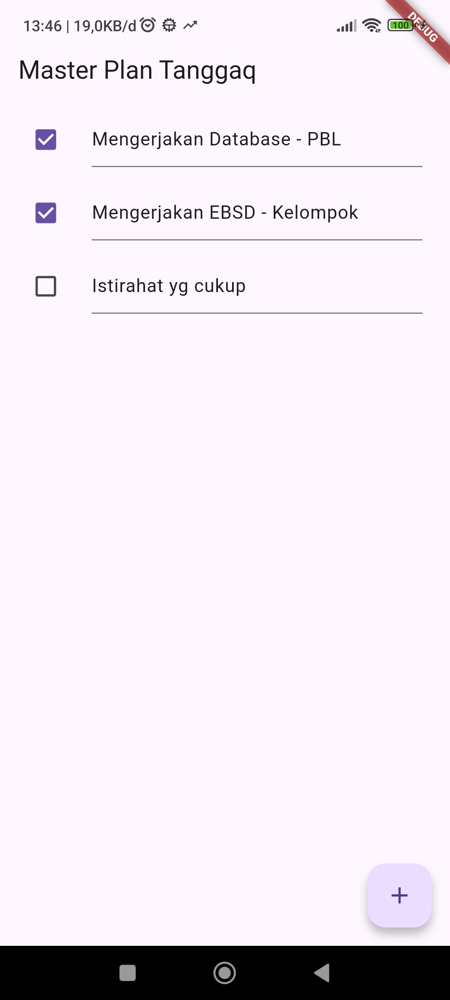
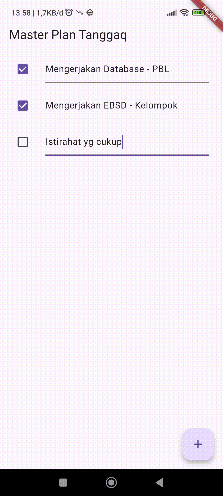
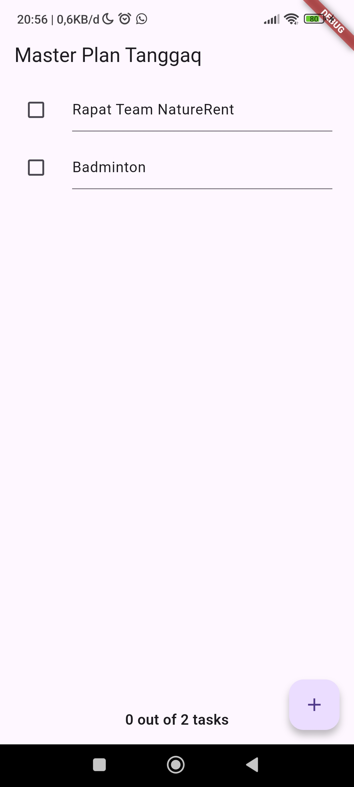
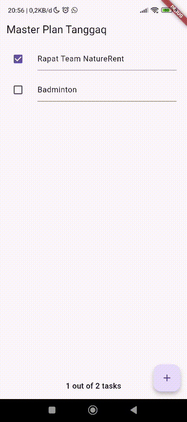
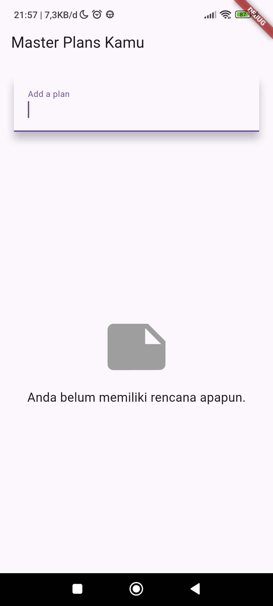
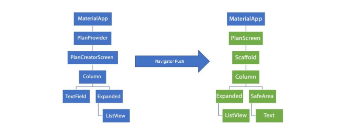
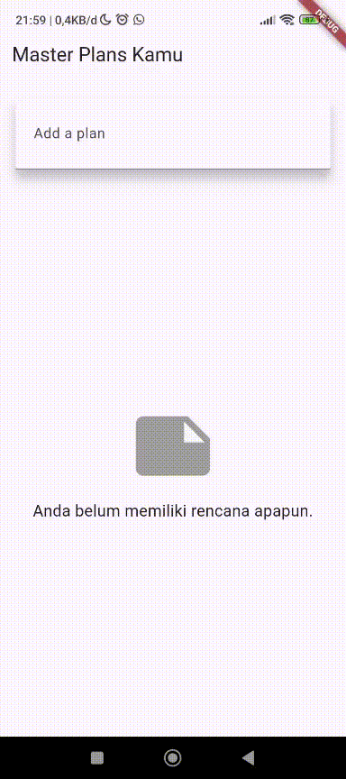

# Laporan Praktikum #10 | Dasar State Management

## Identitas Mahasiswa

| Atribut | Nilai                           |
| ------- | -----                           |
| Nama    | Mochammad Tanggaq Dirat Saputra |
| NIM     | 244107060126                    |
| Kelas   | SIB-2D                          |
---------------------------------------------

# Tugas Praktikum 10 - 1: Dasar State dengan Model-View

## Soal 1
Selesaikan langkah-langkah praktikum tersebut, lalu dokumentasikan berupa GIF hasil akhir praktikum beserta penjelasannya di file README.md! Jika Anda menemukan ada yang error atau tidak berjalan dengan baik, silakan diperbaiki.

### Folder Model - task.dart

``` dart
class Task {
  final String description;
  final bool complete;
  
  const Task({
    this.complete = false,
    this.description = '',
  });
}
```

### Folder Model - plan.dart
``` dart
import './task.dart';

class Plan {
  final String name;
  final List<Task> tasks;
  int get completedCount => tasks

  .where((task) => task.complete).length;

  String get completenessMessage => '$completedCount out of ${tasks.length} tasks';
  
  const Plan({this.name = '', this.tasks = const []});
}
```

### Folder Model - data_layer.dart
``` dart
export 'plan.dart';
export 'task.dart';
```

### File - main.dart
``` dart
import 'package:flutter/material.dart';
import './views/plan_screen.dart';

void main() => runApp(MasterPlanApp());

class MasterPlanApp extends StatelessWidget {
  const MasterPlanApp({super.key});

  @override
  Widget build(BuildContext context) {
    return MaterialApp(
     theme: ThemeData(primarySwatch: Colors.purple),
     home: PlanScreen(),
    );
  }
}
```

### Folder Views - plan_screen.dart
``` dart
import 'package:flutter/material.dart';
import '../models/data_layer.dart';

class PlanScreen extends StatefulWidget {
  const PlanScreen({super.key});

  @override
  State createState() => _PlanScreenState();
}

class _PlanScreenState extends State<PlanScreen> {
  Plan plan = const Plan();

  // ScrollController untuk mengatasi masalah keyboard di iOS
  late ScrollController scrollController;

  @override
  void initState() {
    super.initState();

    scrollController = ScrollController()
      ..addListener(() {
        // Menghilangkan fokus TextField ketika discroll
        FocusScope.of(context).requestFocus(FocusNode());
      });
  }

  @override
  void dispose() {
    scrollController.dispose();
    super.dispose();
  }

  @override
  Widget build(BuildContext context) {
    return Scaffold(
      appBar: AppBar(title: const Text('Master Plan Tanggaq')),
      body: _buildList(),
      floatingActionButton: _buildAddTaskButton(),
    );
  }

  // Tombol Tambah Task
  Widget _buildAddTaskButton() {
    return FloatingActionButton(
      child: const Icon(Icons.add),
      onPressed: () {
        setState(() {
          plan = Plan(
            name: plan.name,
            tasks: List<Task>.from(plan.tasks)..add(const Task()),
          );
        });
      },
    );
  }

  // ListView Builder
  Widget _buildList() {
    return ListView.builder(
      controller: scrollController,
      keyboardDismissBehavior:
          Theme.of(context).platform == TargetPlatform.iOS
              ? ScrollViewKeyboardDismissBehavior.onDrag
              : ScrollViewKeyboardDismissBehavior.manual,
      itemCount: plan.tasks.length,
      itemBuilder: (context, index) =>
          _buildTaskTile(plan.tasks[index], index),
    );
  }

  // Widget ListTile per Task
  Widget _buildTaskTile(Task task, int index) {
    return ListTile(
      leading: Checkbox(
        value: task.complete,
        onChanged: (selected) {
          setState(() {
            plan = Plan(
              name: plan.name,
              tasks: List<Task>.from(plan.tasks)
                ..[index] = Task(
                  description: task.description,
                  complete: selected ?? false,
                ),
            );
          });
        },
      ),
      title: TextFormField(
        initialValue: task.description,
        onChanged: (text) {
          setState(() {
            plan = Plan(
              name: plan.name,
              tasks: List<Task>.from(plan.tasks)
                ..[index] = Task(
                  description: text,
                  complete: task.complete,
                ),
            );
          });
        },
      ),
    );
  }
}
```

### Result




## Soal 2
**Jelaskan maksud dari langkah 4 pada praktikum tersebut! Mengapa dilakukan demikian?**

Pada langkah ke-4, tujuan utama kita adalah menggabungkan beberapa file model, yaitu plan.dart dan task.dart, ke dalam satu file pusat bernama data_layer.dart. Di dalam file data_layer.dart tersebut, kedua file model tadi akan di-export kembali menggunakan perintah export. Pendekatan ini membuat proses import lebih praktis, lebih singkat, dan lebih mudah dikelola, terutama jika model dalam aplikasi semakin banyak. File data_layer.dart berfungsi sebagai “gerbang utama” untuk semua model yang ingin digunakan oleh halaman atau widget lain.

## Soal 3
**Mengapa perlu variabel plan di langkah 6 pada praktikum tersebut? Mengapa dibuat konstanta ?**

Variabel plan digunakan sebagai wadah utama untuk menyimpan dan menampilkan data rencana beserta daftar tugasnya, sedangkan nilai awalnya dibuat const karena pada tahap tersebut datanya masih statis sehingga lebih efisien dan tidak perlu dibuat ulang hingga nanti diperbarui melalui setState().

## Soal 4
**Lakukan capture hasil dari Langkah 9 berupa GIF, kemudian jelaskan apa yang telah Anda buat!**



Pada langkah 9, aplikasi sudah dapat menampilkan daftar tugas (task list) yang bisa di-scroll, diedit, serta ditandai sebagai selesai. Tombol Tambah (+) juga sudah berfungsi untuk menambahkan task baru. Selain itu, fitur keyboard dismiss juga bekerja—ketika layar di-scroll pada iOS, keyboard otomatis menutup sehingga pengguna dapat mengedit item lain tanpa hambatan. GIF tersebut menunjukkan seluruh interaksi tersebut secara menyeluruh di tampilan aplikasi.

## Soal 5
**Apa kegunaan method pada Langkah 11 dan 13 dalam lifecyle state ?**

Method initState pada langkah 11 berfungsi untuk melakukan inisialisasi ketika widget pertama kali dibuat, termasuk menyiapkan dan memasang listener pada scrollController. Sementara itu, method dispose pada langkah 13 digunakan untuk membersihkan dan melepas scrollController ketika widget sudah tidak digunakan lagi, agar tidak terjadi kebocoran memori. Kedua method ini penting dalam lifecycle state karena memastikan penggunaan resource tetap efisien dan aman selama widget aktif maupun saat dihentikan.

## Soal 6
**Kumpulkan laporan praktikum Anda berupa link commit atau repository GitHub ke dosen yang telah disepakati !**

---
# Tugas Praktikum 10 - 2: Mengelola Data Layer dengan InheritedWidget dan InheritedNotifier

## Soal 1
Selesaikan langkah-langkah praktikum tersebut, lalu dokumentasikan berupa GIF hasil akhir praktikum beserta penjelasannya di file README.md! Jika Anda menemukan ada yang error atau tidak berjalan dengan baik, silakan diperbaiki sesuai dengan tujuan aplikasi tersebut dibuat.

### Folder Model - task.dart

``` dart
class Task {
  final String description;
  final bool complete;
  
  const Task({
    this.complete = false,
    this.description = '',
  });
}
```

### Folder Model - plan.dart
``` dart
import './task.dart';

class Plan {
  final String name;
  final List<Task> tasks;

  // Menghitung jumlah task yang sudah selesai
  int get completedCount =>
      tasks.where((task) => task.complete).length;

  // Menampilkan pesan progress penyelesaian task
  String get completenessMessage =>
      '$completedCount out of ${tasks.length} tasks';

  const Plan({
    this.name = '',
    this.tasks = const [],
  });
}
```

### Folder Model - data_layer.dart
``` dart
export 'plan.dart';
export 'task.dart';
```

### File - main.dart
``` dart
import 'package:flutter/material.dart';
import '../models/data_layer.dart';
import './views/plan_screen.dart';
import './views/plan_provider.dart';

void main() => runApp(const MasterPlanApp());

class MasterPlanApp extends StatelessWidget {
  const MasterPlanApp({super.key});

  @override
  Widget build(BuildContext context) {
    return MaterialApp(
      theme: ThemeData(primarySwatch: Colors.purple),
      home: PlanProvider(
        notifier: ValueNotifier<Plan>(const Plan()),
        child: const PlanScreen(),
      ),
    );
  }
}
```

### Folder Views - plan_screen.dart
``` dart
import 'package:flutter/material.dart';
import '../models/data_layer.dart';
import '../views/plan_provider.dart';

class PlanScreen extends StatefulWidget {
  const PlanScreen({super.key});

  @override
  State createState() => _PlanScreenState();
}

class _PlanScreenState extends State<PlanScreen> {
  late ScrollController scrollController;

  @override
  void initState() {
    super.initState();

    scrollController = ScrollController()
      ..addListener(() {
        // Menghilangkan fokus TextField ketika discroll
        FocusScope.of(context).requestFocus(FocusNode());
      });
  }

  @override
  void dispose() {
    scrollController.dispose();
    super.dispose();
  }

  @override
  Widget build(BuildContext context) {
    return Scaffold(
      appBar: AppBar(title: const Text('Master Plan Tanggaq')),

      body: ValueListenableBuilder<Plan>(
        valueListenable: PlanProvider.of(context),
        builder: (context, plan, child) {
          return Column(
            children: [
              Expanded(
                child: _buildList(context, plan),
              ),
              SafeArea(
                child: Padding(
                  padding: const EdgeInsets.all(16.0),
                  child: Text(
                    plan.completenessMessage,
                    style: const TextStyle(
                      fontSize: 16,
                      fontWeight: FontWeight.w600,
                    ),
                  ),
                ),
              )
            ],
          );
        },
      ),

      floatingActionButton: _buildAddTaskButton(context),
    );
  }

  // Tombol Tambah Task
  Widget _buildAddTaskButton(BuildContext context) {
    ValueNotifier<Plan> planNotifier = PlanProvider.of(context);

    return FloatingActionButton(
      child: const Icon(Icons.add),
      onPressed: () {
        Plan currentPlan = planNotifier.value;

        planNotifier.value = Plan(
          name: currentPlan.name,
          tasks: List<Task>.from(currentPlan.tasks)..add(const Task()),
        );
      },
    );
  }

  // ListView builder
  Widget _buildList(BuildContext context, Plan plan) {
    return ListView.builder(
      controller: scrollController,
      keyboardDismissBehavior:
          Theme.of(context).platform == TargetPlatform.iOS
              ? ScrollViewKeyboardDismissBehavior.onDrag
              : ScrollViewKeyboardDismissBehavior.manual,
      itemCount: plan.tasks.length,
      itemBuilder: (context, index) =>
          _buildTaskTile(context, plan.tasks[index], index),
    );
  }

  // Widget untuk setiap task
  Widget _buildTaskTile(BuildContext context, Task task, int index) {
    ValueNotifier<Plan> planNotifier = PlanProvider.of(context);
    Plan plan = planNotifier.value;

    return ListTile(
      leading: Checkbox(
        value: task.complete,
        onChanged: (selected) {
          Plan currentPlan = planNotifier.value;

          planNotifier.value = Plan(
            name: currentPlan.name,
            tasks: List<Task>.from(currentPlan.tasks)
              ..[index] = Task(
                description: task.description,
                complete: selected ?? false,
              ),
          );
        },
      ),
      title: TextFormField(
        initialValue: task.description,
        onChanged: (text) {
          Plan currentPlan = planNotifier.value;

          planNotifier.value = Plan(
            name: currentPlan.name,
            tasks: List<Task>.from(currentPlan.tasks)
              ..[index] = Task(
                description: text,
                complete: task.complete,
              ),
          );
        },
      ),
    );
  }
}
```

### Folder Views - plan_provider.dart
``` dart
import 'package:flutter/material.dart';
import '../models/data_layer.dart';

class PlanProvider extends InheritedNotifier<ValueNotifier<Plan>> {
  const PlanProvider({super.key, required Widget child, required
   ValueNotifier<Plan> notifier})
  : super(child: child, notifier: notifier);

  static ValueNotifier<Plan> of(BuildContext context) {
   return context.
    dependOnInheritedWidgetOfExactType<PlanProvider>()!.notifier!;
  }
}
```

### Result



## Soal 2
**Jelaskan mana yang dimaksud InheritedWidget pada langkah 1 tersebut! Mengapa yang digunakan InheritedNotifier?**

Pada langkah 1, InheritedWidget yang dimaksud adalah PlanProvider, yaitu widget yang membagikan data Plan ke widget lain. PlanProvider memakai InheritedNotifier karena mampu memantau perubahan pada ValueNotifier<Plan>, sehingga widget turunan otomatis diperbarui setiap kali data Plan berubah — membuat pengelolaan state lebih efisien.

## Soal 3
**Jelaskan maksud dari method di langkah 3 pada praktikum tersebut! Mengapa dilakukan demikian?**

Method pada langkah 3 berfungsi menghitung jumlah task yang sudah selesai (completedCount) dan menghasilkan pesan ringkasan progres (completenessMessage). Cara ini digunakan agar perhitungan progres dilakukan langsung oleh model, sehingga tampilan aplikasi bisa menampilkan informasi tugas secara otomatis tanpa perlu menulis ulang logika perhitungan di banyak tempat.

## Soal 4
**Lakukan capture hasil dari Langkah 9 berupa GIF, kemudian jelaskan apa yang telah Anda buat!**

### Result



Widget SafeArea ditambahkan untuk menampilkan completenessMessage di bagian bawah layar tanpa terganggu notch atau sistem UI. Dengan cara ini, setiap perubahan pada tugas langsung memperbarui tampilan progres, sehingga pengguna bisa melihat perkembangan secara jelas dan real-time.

## Soal 5
**Kumpulkan laporan praktikum Anda berupa link commit atau repository GitHub ke dosen yang telah disepakati !**

---
# Tugas Praktikum 10 - 3: Membuat State di Multiple Screens

## Soal 1
Selesaikan langkah-langkah praktikum tersebut, lalu dokumentasikan berupa GIF hasil akhir praktikum beserta penjelasannya di file README.md! Jika Anda menemukan ada yang error atau tidak berjalan dengan baik, silakan diperbaiki sesuai dengan tujuan aplikasi tersebut dibuat.

### Folder Model - task.dart

``` dart
class Task {
  final String description;
  final bool complete;
  
  const Task({
    this.complete = false,
    this.description = '',
  });
}
```

### Folder Model - plan.dart
``` dart
import './task.dart';

class Plan {
  final String name;
  final List<Task> tasks;

  // Menghitung jumlah task yang sudah selesai
  int get completedCount =>
      tasks.where((task) => task.complete).length;

  // Menampilkan pesan progress penyelesaian task
  String get completenessMessage =>
      '$completedCount out of ${tasks.length} tasks';

  const Plan({
    this.name = '',
    this.tasks = const [],
  });
}
```

### Folder Model - data_layer.dart
``` dart
export 'plan.dart';
export 'task.dart';
```

### File - main.dart
``` dart
import 'package:flutter/material.dart';
import './models/data_layer.dart';
import './views/plan_screen.dart';
import './views/plan_provider.dart';
import './views/plan_creator_screen.dart';

void main() => runApp(const MasterPlanApp());

class MasterPlanApp extends StatelessWidget {
  const MasterPlanApp({super.key});

  @override
  Widget build(BuildContext context) {
    return PlanProvider(
      notifier: ValueNotifier<List<Plan>>(const []),
      child: MaterialApp(
        title: 'State management app',
        theme: ThemeData(primarySwatch: Colors.purple),

        // Mengganti ini 
        home: const PlanCreatorScreen(),
      ),
    );
  }
}
```

### Folder Views - plan_screen.dart
``` dart
import 'package:flutter/material.dart';
import '../models/data_layer.dart';
import '../views/plan_provider.dart';

class PlanScreen extends StatefulWidget {
  final Plan plan;

  const PlanScreen({super.key, required this.plan});

  @override
  State createState() => _PlanScreenState();
}

class _PlanScreenState extends State<PlanScreen> {
  late ScrollController scrollController;

  Plan get plan => widget.plan;

  @override
  void initState() {
    super.initState();
    scrollController = ScrollController()
      ..addListener(() {
        FocusScope.of(context).requestFocus(FocusNode());
      });
  }

  @override
  void dispose() {
    scrollController.dispose();
    super.dispose();
  }

  @override
  Widget build(BuildContext context) {
    ValueNotifier<List<Plan>> plansNotifier = PlanProvider.of(context);

    return Scaffold(
      appBar: AppBar(title: Text(plan.name)),
      body: ValueListenableBuilder<List<Plan>>(
        valueListenable: plansNotifier,
        builder: (context, plans, child) {
          final currentPlan =
              plans.firstWhere((p) => p.name == plan.name);

          return Column(
            children: [
              Expanded(child: _buildList(currentPlan)),
              SafeArea(
                child: Padding(
                  padding: const EdgeInsets.all(12.0),
                  child: Text(
                    currentPlan.completenessMessage,
                    style: const TextStyle(
                      fontSize: 16,
                      fontWeight: FontWeight.bold,
                    ),
                  ),
                ),
              )
            ],
          );
        },
      ),
      floatingActionButton: _buildAddTaskButton(context),
    );
  }

  Widget _buildAddTaskButton(BuildContext context) {
    ValueNotifier<List<Plan>> planNotifier = PlanProvider.of(context);

    return FloatingActionButton(
      child: const Icon(Icons.add),
      onPressed: () {
        final currentPlan = plan;
        final index =
            planNotifier.value.indexWhere((p) => p.name == currentPlan.name);

        final updatedTasks =
            List<Task>.from(currentPlan.tasks)..add(const Task());

        planNotifier.value = List<Plan>.from(planNotifier.value)
          ..[index] = Plan(name: currentPlan.name, tasks: updatedTasks);
      },
    );
  }

  Widget _buildList(Plan plan) {
    return ListView.builder(
      controller: scrollController,
      itemCount: plan.tasks.length,
      itemBuilder: (context, index) =>
          _buildTaskTile(plan, plan.tasks[index], index),
    );
  }

  Widget _buildTaskTile(Plan plan, Task task, int index) {
    ValueNotifier<List<Plan>> plansNotifier = PlanProvider.of(context);

    return ListTile(
      leading: Checkbox(
        value: task.complete,
        onChanged: (selected) {
          final currentPlan = plan;
          final planIndex = plansNotifier.value
              .indexWhere((p) => p.name == currentPlan.name);

          plansNotifier.value = List<Plan>.from(plansNotifier.value)
            ..[planIndex] = Plan(
              name: currentPlan.name,
              tasks: List<Task>.from(currentPlan.tasks)
                ..[index] = Task(
                  description: task.description,
                  complete: selected ?? false,
                ),
            );
        },
      ),
      title: TextFormField(
        initialValue: task.description,
        onChanged: (text) {
          final currentPlan = plan;
          final planIndex = plansNotifier.value
              .indexWhere((p) => p.name == currentPlan.name);

          plansNotifier.value = List<Plan>.from(plansNotifier.value)
            ..[planIndex] = Plan(
              name: currentPlan.name,
              tasks: List<Task>.from(currentPlan.tasks)
                ..[index] = Task(
                  description: text,
                  complete: task.complete,
                ),
            );
        },
      ),
    );
  }
}
```

### Folder Views - plan_provider.dart
``` dart
import 'package:flutter/material.dart';
import '../models/data_layer.dart';

class PlanProvider extends InheritedNotifier<ValueNotifier<List<Plan>>> {
  const PlanProvider({
    super.key,
    required Widget child,
    required ValueNotifier<List<Plan>> notifier,
  }) : super(child: child, notifier: notifier);

  static ValueNotifier<List<Plan>> of(BuildContext context) {
    return context
        .dependOnInheritedWidgetOfExactType<PlanProvider>()!
        .notifier!;
  }
}
```

### Folder Views - plan_creator_screen.dart
``` dart
import 'package:flutter/material.dart';
import '../models/data_layer.dart';
import '../views/plan_provider.dart';
import './plan_screen.dart';

class PlanCreatorScreen extends StatefulWidget {
  const PlanCreatorScreen({super.key});

  @override
  State<PlanCreatorScreen> createState() => _PlanCreatorScreenState();
}

class _PlanCreatorScreenState extends State<PlanCreatorScreen> {
  final textController = TextEditingController();

  @override
  void dispose() {
    textController.dispose();
    super.dispose();
  }

  @override
  Widget build(BuildContext context) {
    return Scaffold(
      appBar: AppBar(title: const Text('Master Plans Kamu')),
      body: Column(
        children: [
          _buildListCreator(),
          Expanded(child: _buildMasterPlans()),
        ],
      ),
    );
  }

  Widget _buildListCreator() {
    return Padding(
      padding: const EdgeInsets.all(20.0),
      child: Material(
        color: Theme.of(context).cardColor,
        elevation: 10,
        child: TextField(
          controller: textController,
          decoration: const InputDecoration(
            labelText: 'Add a plan',
            contentPadding: EdgeInsets.all(20),
          ),
          onEditingComplete: addPlan,
        ),
      ),
    );
  }

  void addPlan() {
    final text = textController.text;
    if (text.isEmpty) return;

    final plan = Plan(name: text, tasks: []);

    ValueNotifier<List<Plan>> planNotifier = PlanProvider.of(context);
    planNotifier.value = List<Plan>.from(planNotifier.value)..add(plan);

    textController.clear();
    FocusScope.of(context).requestFocus(FocusNode());
    setState(() {});
  }

  Widget _buildMasterPlans() {
    ValueNotifier<List<Plan>> planNotifier = PlanProvider.of(context);
    final plans = planNotifier.value;

    if (plans.isEmpty) {
      return Column(
        mainAxisAlignment: MainAxisAlignment.center,
        children: const [
          Icon(Icons.note, size: 100, color: Colors.grey),
          SizedBox(height: 10),
          Text(
            'Anda belum memiliki rencana apapun.',
            style: TextStyle(fontSize: 18),
          ),
        ],
      );
    }

    return ListView.builder(
      itemCount: plans.length,
      itemBuilder: (context, index) {
        final plan = plans[index];
        return ListTile(
          title: Text(plan.name),
          subtitle: Text(plan.completenessMessage),
          onTap: () {
            Navigator.of(context).push(
              MaterialPageRoute(
                builder: (_) => PlanScreen(plan: plan),
              ),
            );
          },
        );
      },
    );
  }
}
```

### Result



## Soal 2
Berdasarkan Praktikum 3 yang telah Anda lakukan, jelaskan maksud dari gambar diagram berikut ini!



Diagram ini menggambarkan alur pengelolaan state menggunakan InheritedNotifier serta mekanisme navigasi antar-halaman dengan Navigator, sehingga setiap screen dapat mengakses dan berbagi state secara terstruktur.

Komponen Utama:

1. MaterialApp - Bertindak sebagai root utama yang membungkus keseluruhan aplikasi.
2. PlanProvider - Berfungsi sebagai lapisan InheritedNotifier pada level tertinggi, yang menyediakan state bersama berupa ValueNotifier<List<Plan>> sehingga dapat diakses oleh semua widget di bawahnya.
3. Navigator - Mengatur perpindahan antar-halaman dengan sistem push dan pop pada navigation stack.
4. PlanCreatorScreen - Halaman utama tempat pengguna membuat rencana baru serta melihat daftar semua plan. Ketika sebuah plan dipilih, Navigator.push() akan membuka halaman PlanScreen.
5. PlanScreen - Halaman detail yang digunakan untuk mengelola task dari plan tertentu. Halaman ini menerima objek Plan dari navigasi, dan menyediakan fitur seperti menambah task, mengubah deskripsi, atau menandai task selesai.

Kesimpulan: 

Struktur ini menerapkan konsep “Lift State Up”, di mana state ditempatkan pada level tertinggi melalui PlanProvider agar dapat dibagikan ke banyak layar sekaligus. Navigator bertugas menangani perpindahan antar-screen, sementara InheritedNotifier menjamin seluruh layar selalu menerima pembaruan data terbaru tanpa harus mengirimkan data secara manual atau menggunakan callback.

## Soal 3
Lakukan capture hasil dari Langkah 14 berupa GIF, kemudian jelaskan apa yang telah Anda buat!



Pada langkah ini, aplikasi menambahkan halaman PlanCreatorScreen yang berfungsi sebagai tempat pengguna membuat rencana baru. Pengguna dapat mengetik nama plan melalui TextField, kemudian daftar plan yang sudah dibuat akan muncul dalam ListView yang disusun di dalam sebuah Column.

Setelah sebuah plan ditambahkan, aplikasi akan berpindah ke PlanScreen menggunakan Navigator.push, sehingga pengguna dapat melihat dan mengelola daftar tugas yang berkaitan dengan plan tersebut. Pada PlanScreen, informasi progres—seperti jumlah tugas yang telah diselesaikan—ditampilkan menggunakan SafeArea agar tidak tertutup notch atau area sistem lainnya.

Langkah ini membantu memahami cara membangun tampilan yang bersifat dinamis, mengatur state bersama, serta melakukan navigasi antar-halaman dalam Flutter.

## Soal 4
Kumpulkan laporan praktikum Anda berupa link commit atau repository GitHub ke dosen yang telah disepakati !