# Laporan Praktikum #11 | Pemrograman Asynchronous

## Identitas Mahasiswa

| Atribut | Nilai                           |
| ------- | -----                           |
| Nama    | Mochammad Tanggaq Dirat Saputra |
| NIM     | 244107060126                    |
| Kelas   | SIB-2D                          |
---------------------------------------------

## Praktikum 1: Mengunduh Data dari Web Service (API)

### Langkah 1: Buat Project Baru & Langkah 2: Cek file pubspec.yaml

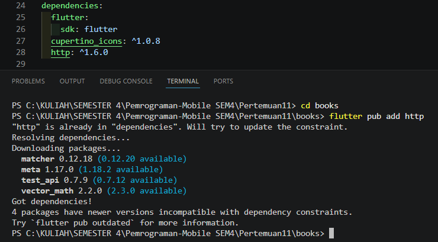

### Langkah 3: Buka file main.dart

### **Soal 1**
Tambahkan nama panggilan Anda pada title app sebagai identitas hasil pekerjaan Anda.
``` dart
import 'dart:async';
import 'package:flutter/material.dart';
import 'package:http/http.dart' as http;

void main() {
  runApp(const MyApp());
}

class MyApp extends StatelessWidget {
  const MyApp({super.key});

  @override
  Widget build(BuildContext context) {
    return MaterialApp(
      title: 'Future Demo - Tanggaq',
      theme: ThemeData(
        primarySwatch: Colors.blue,
        visualDensity: VisualDensity.adaptivePlatformDensity,
      ),
      home: const FuturePage(),
    );
  }
}

class FuturePage extends StatefulWidget {
  const FuturePage({super.key});

  @override
  State<FuturePage> createState() => FuturePageState();
}

class FuturePageState extends State<FuturePage> {
  String result = "";

  @override
  Widget build(BuildContext context) {
    return Scaffold(
      appBar: AppBar(
        title: const Text("Back from the Future - Tanggaq"),
      ),
      body: Center(
        child: Column(
          children: [
            const Spacer(),

            ElevatedButton(
              child: const Text("Go"),
              onPressed: () {},
            ),

            const Spacer(),

            Text(result),

            const SizedBox(height: 20),

            const CircularProgressIndicator(),

            const Spacer(),
          ],
        ),
      ),
    );
  }
}
```

### Langkah 4: Tambah method getData()

```dart
Future<http.Response> getData() async {
  const authority = 'www.googleapis.com';
  const path = '/books/v1/volumes/junbDwAAQBAJ';

  Uri url = Uri.https(authority, path);

  return http.get(url);
}
```

### **Soal 2**
Carilah judul buku favorit Anda di Google Books Kemudian cobalah akses di browser URI tersebut dengan lengkap seperti ini

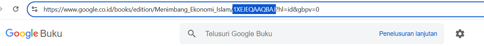

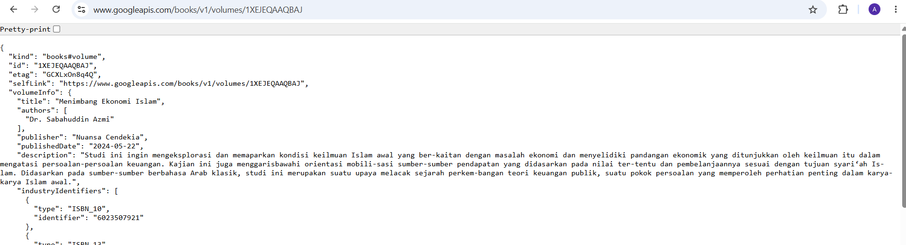

### Langkah 5: Tambah kode di ElevatedButton

```dart
ElevatedButton(
  child: const Text('GO!'),
  onPressed: () {
    setState(() {}); // refresh UI dulu

    getData().then((value) {
      result = value.body.toString().substring(0, 450);
      setState(() {});
    }).catchError((_) {
      result = 'An error occurred';
      setState(() {});
    });
  },
),
```

### **Soal 3**
Jelaskan maksud kode langkah 5 tersebut terkait substring dan catchError!, lalu Capture hasil praktikum Anda berupa GIF dan lampirkan di README.

Pada langkah 5, tombol GO! menjalankan proses pengambilan data dari API. Di dalamnya terdapat dua bagian penting—substring() dan catchError()—yang punya peran berbeda dalam mengatur tampilan dan penanganan error.

1. substring(0, 450):

Bagian ini berfungsi untuk memotong data JSON yang diterima dari Google Books API.
Response API biasanya sangat panjang, sehingga kalau ditampilkan seluruhnya, tampilan aplikasi bisa jadi penuh dan tidak rapi.

- Method substring(0, 450) digunakan untuk memotong string hasil response dari API
- Mengambil karakter dari indeks 0 sampai 450 (450 karakter pertama)
- Tujuannya adalah untuk membatasi jumlah data yang ditampilkan di UI agar tidak terlalu banyak
- Jika tidak menggunakan substring, seluruh response JSON (yang bisa sangat panjang) akan ditampilkan dan membuat UI terlihat berantakan

Jadi, fungsi ini semacam filter tampilan awal agar datanya tidak berlebihan.

2. catchError((_)):

Bagian ini meng-handle kondisi ketika permintaan API mengalami masalah.

- Method catchError() digunakan untuk menangkap dan mengelola error yang mungkin terjadi saat memanggil API
- Jika terjadi error (misalnya: tidak ada koneksi internet, timeout, URL tidak valid, dll), maka blok kode dalam catchError akan dieksekusi
- Parameter (_) menandakan bahwa kita tidak menggunakan object error yang ditangkap
- Dalam blok catchError, result diisi dengan pesan "An error occurred" untuk memberitahu user bahwa terjadi kesalahan
- setState(() {}) dipanggil untuk memperbarui UI dan menampilkan pesan error kepada user

Secara sederhana, catchError() bertugas sebagai penyelamat ketika proses fetch data tidak berjalan mulus.

Outputnya

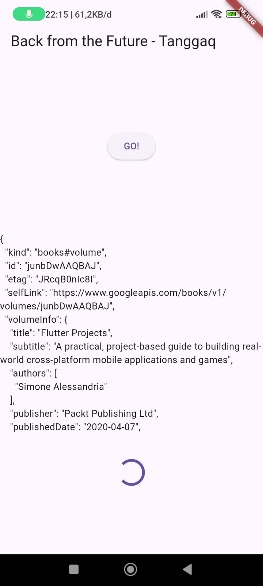

## Praktikum 2: Menggunakan await/async untuk menghindari callbacks

### Langkah 1: Buka file main.dart
``` dart
import 'dart:async';
import 'package:flutter/material.dart';
import 'package:http/http.dart' as http;

void main() {
  runApp(const MyApp());
}

class MyApp extends StatelessWidget {
  const MyApp({super.key});

  @override
  Widget build(BuildContext context) {
    return MaterialApp(
      title: 'Future Demo - Tanggaq',
      theme: ThemeData(
        primarySwatch: Colors.blue,
        visualDensity: VisualDensity.adaptivePlatformDensity,
      ),
      home: const FuturePage(),
    );
  }
}

class FuturePage extends StatefulWidget {
  const FuturePage({super.key});

  @override
  State<FuturePage> createState() => FuturePageState();
}

class FuturePageState extends State<FuturePage> {
  String result = "";

  // Langkah 1: Tambahkan tiga method Future di sini
  Future<int> returnOneAsync() async {
    await Future.delayed(const Duration(seconds: 3));
    return 1;
  }

  Future<int> returnTwoAsync() async {
    await Future.delayed(const Duration(seconds: 3));
    return 2;
  }

  Future<int> returnThreeAsync() async {
    await Future.delayed(const Duration(seconds: 3));
    return 3;
  }

  // Langkah 4: Method getData()
  Future<http.Response> getData() async {
    const authority = 'www.googleapis.com';
    const path = '/books/v1/volumes/junbDwAAQBAJ';

    Uri url = Uri.https(authority, path);
    return http.get(url);
  }


  @override
  Widget build(BuildContext context) {
    return Scaffold(
      appBar: AppBar(
        title: const Text("Back from the Future - Tanggaq"),
      ),
      body: Center(
        child: Column(
          children: [
            const Spacer(),

            ElevatedButton(
              child: const Text('GO!'),
              onPressed: () {
                setState(() {}); // refresh UI

                getData().then((value) {
                  result = value.body.toString().substring(0, 450);
                  setState(() {});
                }).catchError((_) {
                  result = 'An error occurred';
                  setState(() {});
                });
              },
            ),

            const Spacer(),

            Text(result),

            const SizedBox(height: 20),

            const CircularProgressIndicator(),

            const Spacer(),
          ],
        ),
      ),
    );
  }
}
```

### Langkah 2: Tambah method count()
```dart
Future<void> count() async {
  int total = 0;

  total = await returnOneAsync();
  total += await returnTwoAsync();
  total += await returnThreeAsync();

  setState(() {
    result = total.toString();
  });
}
```

### Langkah 3: Panggil count()
``` dart
ElevatedButton(
  child: const Text("GO!"),
  onPressed: () {
    count(); // memanggil Future berurutan
  },
),
```

### Langkah 4: Run

### **Soal 4**
Jelaskan maksud kode langkah 1 dan 2 tersebut!, lalu Capture hasil praktikum Anda berupa GIF dan lampirkan di README.

Penjelasan Langkah 1

```dart
Future<int> returnOneAsync() async {
  await Future.delayed(const Duration(seconds: 3));
  return 1;
}

Future<int> returnTwoAsync() async {
  await Future.delayed(const Duration(seconds: 3));
  return 2;
}

Future<int> returnThreeAsync() async {
  await Future.delayed(const Duration(seconds: 3));
  return 3;
}
```

- Ketiga method ini adalah fungsi asynchronous yang mengembalikan nilai Future<int>
- async menandakan fungsi berjalan di background (tidak memblokir UI)
- await Future.delayed(const Duration(seconds: 3)) = menunggu selama 3 detik sebelum menjalankan kode berikutnya (simulasi proses yang memakan waktu, seperti API call)
- Masing-masing method mengembalikan nilai berbeda:
    - returnOneAsync() → mengembalikan 1
    - returnTwoAsync() → mengembalikan 2
    - returnThreeAsync() → mengembalikan 3

Penjelasan Langkah 2

``` dart
Future count() async {
  int total = 0;
  total = await returnOneAsync();
  total += await returnTwoAsync();
  total += await returnThreeAsync();
  setState(() {
    result = total.toString();
  });
}
```

- Method count() adalah fungsi yang menggabungkan hasil dari ketiga method di atas
- int total = 0; = inisialisasi variable total dengan nilai 0
- total = await returnOneAsync(); = tunggu hingga returnOneAsync() selesai, hasilnya (1) disimpan ke total → total = 1
- total += await returnTwoAsync(); = tunggu hingga returnTwoAsync() selesai, tambahkan hasilnya (2) ke total → total = 1 + 2 = 3
- total += await returnThreeAsync(); = tunggu hingga returnThreeAsync() selesai, tambahkan hasilnya (3) ke total → total = 3 + 3 = 6
- setState(() { result = total.toString(); }) = tampilkan hasil akhir (6) di UI

Outputnya

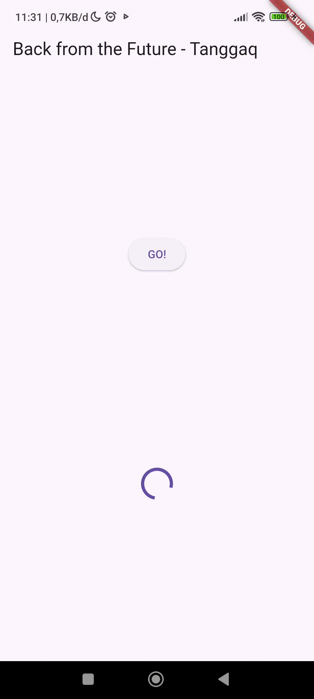

## Praktikum 3: Menggunakan Completer di Future

### Langkah 1: Buka main.dart

### Langkah 2: Tambahkan variabel dan method

### Langkah 3: Ganti isi kode onPressed()

### Hasil Akhir : 
``` dart
import 'dart:async';
import 'package:flutter/material.dart';
import 'package:http/http.dart' as http;
import 'package:async/async.dart';

void main() {
  runApp(const MyApp());
}

class MyApp extends StatelessWidget {
  const MyApp({super.key});

  @override
  Widget build(BuildContext context) {
    return MaterialApp(
      title: 'Future Demo - Tanggaq',
      theme: ThemeData(
        primarySwatch: Colors.blue,
        visualDensity: VisualDensity.adaptivePlatformDensity,
      ),
      home: const FuturePage(),
    );
  }
}

class FuturePage extends StatefulWidget {
  const FuturePage({super.key});

  @override
  State<FuturePage> createState() => FuturePageState();
}

class FuturePageState extends State<FuturePage> {
  String result = "";
  
  // Langkah 1: Tambah Completer
  late Completer<int> completer;

  // Langkah 2: Method getNumber() dan calculate()
  Future<int> getNumber() {
    completer = Completer<int>();
    calculate();
    return completer.future;
  }

  Future<void> calculate() async {
    await Future.delayed(const Duration(seconds: 5));
    completer.complete(42);
  }

  // (SISA METHOD DARI SOAL SEBELUMNYA)
  Future<int> returnOneAsync() async {
    await Future.delayed(const Duration(seconds: 3));
    return 1;
  }

  Future<int> returnTwoAsync() async {
    await Future.delayed(const Duration(seconds: 3));
    return 2;
  }

  Future<int> returnThreeAsync() async {
    await Future.delayed(const Duration(seconds: 3));
    return 3;
  }

  Future<void> count() async {
    int total = 0;

    total = await returnOneAsync();
    total += await returnTwoAsync();
    total += await returnThreeAsync();

    setState(() {
      result = total.toString();
    });
  }

  Future<http.Response> getData() async {
    const authority = 'www.googleapis.com';
    const path = '/books/v1/volumes/junbDwAAQBAJ';

    Uri url = Uri.https(authority, path);
    return http.get(url);
  }


  @override
  Widget build(BuildContext context) {
    return Scaffold(
      appBar: AppBar(
        title: const Text("Back from the Future - Tanggaq"),
      ),
      body: Center(
        child: Column(
          children: [
            const Spacer(),

            // Langkah 3: onPressed diganti menjadi getNumber()
            ElevatedButton(
              child: const Text("GO!"),
              onPressed: () {
                getNumber().then((value) {
                  setState(() {
                    result = value.toString();
                  });
                });
              },
            ),

            const Spacer(),

            Text(
              result,
              style: const TextStyle(fontSize: 32),
            ),

            const SizedBox(height: 20),

            const CircularProgressIndicator(),

            const Spacer(),
          ],
        ),
      ),
    );
  }
}
```

### Langkah 4: Run

### **Soal 5**
Jelaskan maksud kode langkah 2 tersebut!, Capture hasil praktikum Anda berupa GIF dan lampirkan di README

``` dart
late Completer completer;

Future getNumber() {
  completer = Completer<int>();
  calculate();
  return completer.future;
}

Future calculate() async {
  await Future.delayed(const Duration(seconds : 5));
  completer.complete(42);
}
```

1. late Completer completer;
- Keyword late menunjukkan variable akan diinisialisasi nanti, bukan saat deklarasi. Completer adalah class untuk mengontrol Future secara manual, memungkinkan kita menentukan kapan Future selesai dan nilai apa yang dikembalikan.

2. Future getNumber()
- Method mengembalikan Future<int>, berjanji akan memberikan nilai integer di masa depan
- completer = Completer<int>() membuat object Completer baru untuk mengelola nilai integer
- calculate() memanggil method yang akan menjalankan proses asynchronous
- return completer.future mengembalikan Future yang akan diselesaikan oleh method calculate() nanti

3. Future calculate() async
- Method async ini menjalankan proses panjang secara asynchronous
- await Future.delayed(const Duration(seconds: 5)) menunggu selama 5 detik (simulasi pekerjaan berat seperti API call atau database query)
- completer.complete(42) menyelesaikan Future dengan mengembalikan nilai 42

Outputnya


### Langkah 5: Ganti method calculate()

### Langkah 6: Pindah ke onPressed()

### Hasil Akhir : 
``` dart
import 'dart:async';
import 'package:flutter/material.dart';
import 'package:http/http.dart' as http;
import 'package:async/async.dart';

void main() {
  runApp(const MyApp());
}

class MyApp extends StatelessWidget {
  const MyApp({super.key});

  @override
  Widget build(BuildContext context) {
    return MaterialApp(
      title: 'Future Demo - Tanggaq',
      theme: ThemeData(
        primarySwatch: Colors.blue,
        visualDensity: VisualDensity.adaptivePlatformDensity,
      ),
      home: const FuturePage(),
    );
  }
}

class FuturePage extends StatefulWidget {
  const FuturePage({super.key});

  @override
  State<FuturePage> createState() => FuturePageState();
}

class FuturePageState extends State<FuturePage> {
  String result = "";

  // Completer utama
  late Completer<int> completer;

  // getNumber() – memulai proses dan mengembalikan Future<int>
  Future<int> getNumber() {
    completer = Completer<int>();
    calculate(); // memulai proses async
    return completer.future;
  }

  // Langkah 5: calculate() diganti memakai try–catch + completeError
  Future<void> calculate() async {
    try {
      await Future.delayed(const Duration(seconds: 5));
      completer.complete(42); // berhasil

      // untuk test error, bisa aktifkan ini:
      // throw Exception();
    } catch (_) {
      completer.completeError({}); // error dikembalikan
    }
  }

  // (Sisa method praktikum sebelumnya — tetap disimpan)

  Future<int> returnOneAsync() async {
    await Future.delayed(const Duration(seconds: 3));
    return 1;
  }

  Future<int> returnTwoAsync() async {
    await Future.delayed(const Duration(seconds: 3));
    return 2;
  }

  Future<int> returnThreeAsync() async {
    await Future.delayed(const Duration(seconds: 3));
    return 3;
  }

  Future<void> count() async {
    int total = 0;

    total = await returnOneAsync();
    total += await returnTwoAsync();
    total += await returnThreeAsync();

    setState(() {
      result = total.toString();
    });
  }

  Future<http.Response> getData() async {
    const authority = 'www.googleapis.com';
    const path = '/books/v1/volumes/junbDwAAQBAJ';

    Uri url = Uri.https(authority, path);
    return http.get(url);
  }


  @override
  Widget build(BuildContext context) {
    return Scaffold(
      appBar: AppBar(
        title: const Text("Back from the Future - Tanggaq"),
      ),
      body: Center(
        child: Column(
          children: [
            const Spacer(),

            // Langkah 6: onPressed memakai then + catchError
            ElevatedButton(
              child: const Text("GO!"),
              onPressed: () {
                getNumber().then((value) {
                  setState(() {
                    result = value.toString();
                  });
                }).catchError((e) {
                  setState(() {
                    result = 'An error occurred';
                  });
                });
              },
            ),

            const Spacer(),

            Text(
              result,
              style: const TextStyle(fontSize: 28),
            ),

            const SizedBox(height: 20),

            const CircularProgressIndicator(),

            const Spacer(),
          ],
        ),
      ),
    );
  }
}
```

### **Soal 6**
Jelaskan maksud perbedaan kode langkah 2 dengan langkah 5-6 tersebut!, Capture hasil praktikum Anda berupa GIF dan lampirkan di README

Langkah 2 (Kode awal)
``` dart
// Method calculate() - Langkah 2
Future calculate() async {
  await Future.delayed(const Duration(seconds: 5));
  completer.complete(42);
}

// onPressed() - Langkah 2
onPressed: () {
  getNumber().then((value) {
    setState(() {
      result = value.toString();
    });
  });
}
```

Langkah 5 & 6 (Kode dengan Error Handling)
``` dart
// Method calculate() - Langkah 5
Future calculate() async {
  try {
    await Future.delayed(const Duration(seconds: 5));
    completer.complete(42);
  } catch (_) {
    completer.completeError({});
  }
}

// onPressed() - Langkah 6
onPressed: () {
  getNumber().then((value) {
    setState(() {
      result = value.toString();
    });
  }).catchError((e) {
    result = 'An error occurred';
  });
}
```

**Perbedaan Method calculate() dan onPressed() - Langkah 2 vs Langkah 5-6**

**1. Method calculate() - Langkah 2 vs Langkah 5**
- Langkah 2 (Tanpa Penanganan Error)
    - Kode ini langsung menjalankan Future.delayed() dan completer.complete(42) tanpa mekanisme penanganan error atau exception, sehingga jika terjadi error, aplikasi bisa mengalami crash atau Future tidak akan pernah selesai. Risiko ini sangat tinggi untuk production environment.

- Langkah 5 (Dengan Try-Catch)
    - Dengan mengimplementasikan blok try-catch, kode dapat mengatasi kemungkinan terjadinya error secara lebih aman dan robust. Blok try melakukan eksekusi kode normal dengan delay 5 detik kemudian complete dengan value 42, sementara blok catch menangkap exception dan memanggil completer.completeError() untuk menyelesaikan Future dengan status error, sehingga memberikan proteksi terhadap kemungkinan terjadinya error.

**2. Method onPressed() - Langkah 2 vs Langkah 6:**
- Langkah 2 (Tanpa catchError)
    - Kode hanya mempunyai handler .then() untuk menangani hasil yang berhasil, sehingga apabila Future selesai dengan error, tidak ada handler yang menanganinya dan bisa menghasilkan unhandled error yang tidak terkelola.

- Langkah 6 (Dengan catchError)
    - Kode mempunyai handler .then() untuk menangani hasil yang berhasil dan handler .catchError() untuk menangani jika terjadi error. Apabila completer.completeError() dijalankan, error akan ditangkap di .catchError() dan menampilkan pesan "An error occurred" kepada user sebagai feedback, sehingga lebih user-friendly karena memberikan notifikasi jika terjadi error.

Outputnya


## Praktikum 4: Memanggil Future secara paralel

### Langkah 1: Buka file main.dart

### Langkah 2: Edit onPressed()

### Hasil Akhir : 
``` dart
import 'dart:async';
import 'package:flutter/material.dart';
import 'package:http/http.dart' as http;
import 'package:async/async.dart';

void main() {
  runApp(const MyApp());
}

class MyApp extends StatelessWidget {
  const MyApp({super.key});

  @override
  Widget build(BuildContext context) {
    return MaterialApp(
      title: 'Future Demo - Tanggaq',
      theme: ThemeData(
        primarySwatch: Colors.blue,
        visualDensity: VisualDensity.adaptivePlatformDensity,
      ),
      home: const FuturePage(),
    );
  }
}

class FuturePage extends StatefulWidget {
  const FuturePage({super.key});

  @override
  State<FuturePage> createState() => FuturePageState();
}

class FuturePageState extends State<FuturePage> {
  String result = "";

  //   METHOD ASYNC (Sebelumnya)
  Future<int> returnOneAsync() async {
    await Future.delayed(const Duration(seconds: 3));
    return 1;
  }

  Future<int> returnTwoAsync() async {
    await Future.delayed(const Duration(seconds: 3));
    return 2;
  }

  Future<int> returnThreeAsync() async {
    await Future.delayed(const Duration(seconds: 3));
    return 3;
  }

  //   SOAL FUTUREGROUP (Baru)
  void returnFG() {
    FutureGroup<int> futureGroup = FutureGroup<int>();

    // Tambah future ke group
    futureGroup.add(returnOneAsync());
    futureGroup.add(returnTwoAsync());
    futureGroup.add(returnThreeAsync());

    // Tutup input FutureGroup
    futureGroup.close();

    // Ketika semua future selesai → hasil dalam satu list
    futureGroup.future.then((List<int> value) {
      int total = 0;

      for (var element in value) {
        total += element;
      }

      setState(() {
        result = total.toString();
      });
    });
  }

  // (Ada tapi tidak dipakai untuk Soal 5)
  Future<http.Response> getData() async {
    const authority = 'www.googleapis.com';
    const path = '/books/v1/volumes/junbDwAAQBAJ';

    Uri url = Uri.https(authority, path);
    return http.get(url);
  }

  //   UI / WIDGET
  @override
  Widget build(BuildContext context) {
    return Scaffold(
      appBar: AppBar(
        title: const Text("Back from the Future - Tanggaq"),
      ),
      body: Center(
        child: Column(
          children: [
            const Spacer(),

            // Tombol menjalankan FutureGroup
            ElevatedButton(
              child: const Text("GO!"),
              onPressed: () {
                returnFG();
              },
            ),

            const Spacer(),

            Text(
              result,
              style: const TextStyle(fontSize: 32),
            ),

            const SizedBox(height: 20),

            const CircularProgressIndicator(),

            const Spacer(),
          ],
        ),
      ),
    );
  }
}
```

### Langkah 3: Run

### **Soal 7**
Capture hasil praktikum Anda berupa GIF dan lampirkan di README.

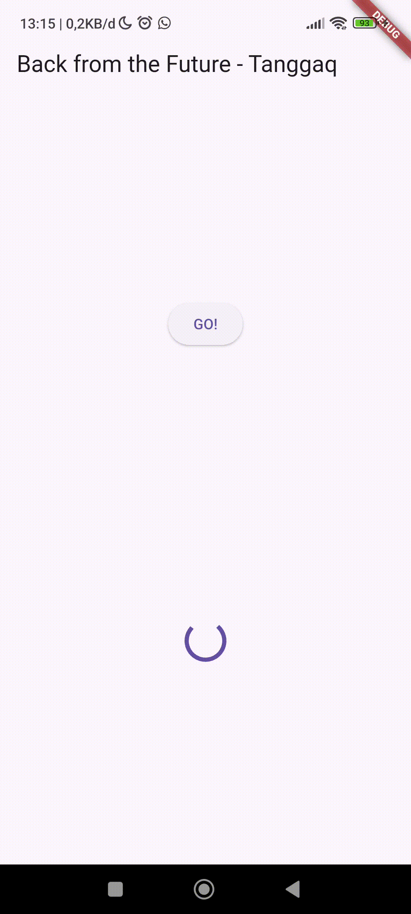

### Langkah 4: Ganti variabel futureGroup

### **Soal 8**
Jelaskan maksud perbedaan kode langkah 1 dan 4!

Langkah 1 - Menggunakan FutureGroup
```dart
void returnFG() {
  FutureGroup<int> futureGroup = FutureGroup<int>();
  futureGroup.add(returnOneAsync());
  futureGroup.add(returnTwoAsync());
  futureGroup.add(returnThreeAsync());
  futureGroup.close();
  futureGroup.future.then((List<int> value) {
    int total = 0;
    for (var element in value) {
      total += element;
    }
    setState(() {
      result = total.toString();
    });
  });
}
```

Langkah 4 - Menggunakan Future.wait
``` dart
void returnFG() {
  final futures = Future.wait<int>([
    returnOneAsync(),
    returnTwoAsync(),
    returnThreeAsync(),
  ]);
  futures.then((List<int> value) {
    int total = 0;
    for (var element in value) {
      total += element;
    }
    setState(() {
      result = total.toString();
    });
  });
}
```

**Perbedaan kode langkah 1 dan 4**

**1. Cara Membuat dan Mengelola Future**
- Langkah 1 (FutureGroup)
    - Menggunakan class FutureGroup dari package async/async.dart, kita dapat membuat instance FutureGroup<int>() dan menambahkan Future secara individual menggunakan method .add(). Setelah itu, wajib memanggil .close() untuk memberikan signal bahwa tidak ada Future lagi yang akan dimasukkan, kemudian mengakses hasil melalui futureGroup.future.then(). Implementasi ini memerlukan import import 'package:async/async.dart';.

- Langkah 4 (Future.wait)
    - Menggunakan method Future.wait() yang merupakan built-in functionality dari Dart, kita dapat langsung menerima List of Futures sebagai parameter dalam bentuk array [...] tanpa memerlukan pemanggilan .close() karena list sudah bersifat final. Method ini langsung mengembalikan Future yang dapat di-chain dengan .then() dan tidak membutuhkan import tambahan karena sudah tersedia di dart:async yang built-in.

**2. Sintaks**
- Langkah 1 (FutureGroup)
    - FutureGroup lebih verbose dengan banyak baris kode dan memerlukan 5 langkah eksekusi: buat instance, add Future 1, add Future 2, add Future 3, kemudian close. Approach ini cocok digunakan jika jumlah Future bersifat dinamis atau ditambahkan secara kondisional, namun menghasilkan struktur kode yang lebih panjang dan detail.

- Langkah 4 (Future.wait)
    - Future.wait() lebih ringkas dan clean dengan sedikit baris kode, menggunakan pendekatan deklaratif di mana semua Future didefinisikan dalam satu list secara langsung. Approach ini mudah dibaca dan dipahami karena struktur yang simple, dan cocok digunakan ketika semua Future sudah diketahui di awal dan jumlahnya tetap.

**Kesimpulan**

Kedua pendekatan mencapai tujuan yang sama (menjalankan multiple Future secara paralel), tetapi:
- FutureGroup: Lebih fleksibel tetapi lebih verbose, memerlukan package eksternal
- Future.wait: Lebih sederhana, clean, dan merupakan cara standar/idiomatis di Dart

## Praktikum 5: Menangani Respon Error pada Async Code

### Langkah 1: Buka file main.dart

### Langkah 2: ElevatedButton

### Langkah 3: Run
``` dart
import 'dart:async';
import 'package:flutter/material.dart';
import 'package:http/http.dart' as http;
import 'package:async/async.dart';

void main() {
  runApp(const MyApp());
}

class MyApp extends StatelessWidget {
  const MyApp({super.key});

  @override
  Widget build(BuildContext context) {
    return MaterialApp(
      title: 'Future Demo - Tanggaq',
      theme: ThemeData(
        primarySwatch: Colors.blue,
        visualDensity: VisualDensity.adaptivePlatformDensity,
      ),
      home: const FuturePage(),
    );
  }
}

class FuturePage extends StatefulWidget {
  const FuturePage({super.key});

  @override
  State<FuturePage> createState() => FuturePageState();
}

class FuturePageState extends State<FuturePage> {
  String result = "";

  // Future Methods

  Future<int> returnOneAsync() async {
    await Future.delayed(const Duration(seconds: 3));
    return 1;
  }

  Future<int> returnTwoAsync() async {
    await Future.delayed(const Duration(seconds: 3));
    return 2;
  }

  Future<int> returnThreeAsync() async {
    await Future.delayed(const Duration(seconds: 3));
    return 3;
  }

  // Future.wait

  void returnFG() {
    final futures = Future.wait<int>([
      returnOneAsync(),
      returnTwoAsync(),
      returnThreeAsync(),
    ]);

    futures.then((List<int> value) {
      int total = 0;

      for (var element in value) {
        total += element;
      }

      setState(() {
        result = total.toString();
      });
    });
  }

  // Langkah Baru: returnError()

  Future returnError() async {
    await Future.delayed(const Duration(seconds: 2));

    throw Exception('Something terrible happened!');
  }

  // HTTP Request (masih ada)

  Future<http.Response> getData() async {
    const authority = 'www.googleapis.com';
    const path = '/books/v1/volumes/junbDwAAQBAJ';

    Uri url = Uri.https(authority, path);

    return http.get(url);
  }

  // UI

  @override
  Widget build(BuildContext context) {
    return Scaffold(
      appBar: AppBar(
        title: const Text("Back from the Future - Tanggaq"),
      ),
      body: Center(
        child: Column(
          children: [
            const Spacer(),

            // ElevatedButton terbaru
            ElevatedButton(
              child: const Text("GO!"),
              onPressed: () {
                returnError()
                    .then((value) {
                  setState(() {
                    result = 'Success';
                  });
                }).catchError((onError) {
                  setState(() {
                    result = onError.toString();
                  });
                }).whenComplete(() => print('Complete'));
              },
            ),

            const Spacer(),

            Text(
              result,
              style: const TextStyle(fontSize: 24),
              textAlign: TextAlign.center,
            ),

            const SizedBox(height: 20),

            const CircularProgressIndicator(),

            const Spacer(),
          ],
        ),
      ),
    );
  }
}
```

### **Soal 9**
Capture hasil praktikum Anda berupa GIF dan lampirkan di README

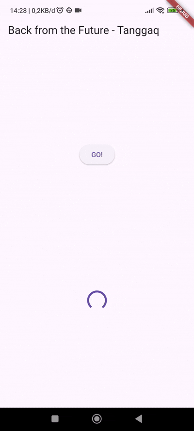

### Langkah 4: Tambah method handleError()

``` dart
Future<void> handleError() async {
  try {
    await returnError();
  } catch (error) {
    setState(() {
      result = error.toString();
    });
  } finally {
    print("Complete");
  }
}
```

### **Soal 10**
Panggil method handleError() tersebut di ElevatedButton, lalu run. Apa hasilnya? Jelaskan perbedaan kode langkah 1 dan 4!

**Hasil yang ditampilkan**

Ketika tombol "GO!" ditekan, setelah 2 detik aplikasi akan menampilkan:

- Di layar (UI): "Exception: Something terrible happened!"
- Di console: "Complete"

**Perbedaan Kode Langkah 1 dan Langkah 4**

Langkah 1 - Error Handling dengan .then().catchError().whenComplete()
``` dart
onPressed: () {
  returnError()
      .then((value) {
        setState(() {
          result = 'Success';
        });
      })
      .catchError((onError) {
        setState(() {
          result = onError.toString();
        });
      })
      .whenComplete(() => print('Complete'));
}
```

Langkah 4 - Error Handling dengan try-catch-finally
``` dart
Future handleError() async {
  try {
    await returnError();
  } catch (error) {
    setState(() {
      result = error.toString();
    });
  } finally {
    print('Complete');
  }
}

// Dipanggil di onPressed
onPressed: () {
  handleError();
}
```

**Perbedaan**

**1. Pendekatan Error Handling**
- Langkah 1 (Functional/Chaining approach)
    - Menggunakan method chaining dengan .then(), .catchError(), dan .whenComplete() dengan pendekatan functional programming style, di mana error handling dilakukan dengan callback functions dan kode ditulis inline di dalam onPressed().

- Langkah 4 (Imperative/try-catch approach)
    - Menggunakan try-catch-finally yang lebih tradisional dengan pendekatan imperative programming style, di mana error handling menggunakan blok try-catch dan kode dipisahkan ke method handleError() yang terpisah.

**2. Struktur Kode**
- Langkah 1
    - Dengan pendekatan method chaining, semua logic error handling ada di dalam onPressed() sehingga lebih ringkas untuk kasus sederhana, namun method chaining membuat kode horizontal dan bisa panjang ke samping.

- Langkah 4
    - Dengan memisahkan logic error handling ke method terpisah, kode menjadi lebih modular dan reusable, struktur kode lebih vertikal dan mudah dibaca, serta onPressed() menjadi lebih clean dan fokus pada business logic.

**3. Penggunaan async/await**
- Langkah 1
    - Pendekatan ini tidak menggunakan await secara eksplisit, melainkan mengandalkan Promise-like pattern dengan .then(), sehingga dapat menangani asynchronous operation tanpa perlu method async.

- Langkah 4
    - Pendekatan ini menggunakan async/await secara eksplisit dengan method yang harus ditandai dengan async, sehingga lebih mudah dibaca seperti kode synchronous dan menggunakan await untuk menunggu Future selesai.

**4. Error Object**
- Langkah 1
    - Parameter di catchError adalah onError yang langsung dikonversi ke string menggunakan onError.toString().

- Langkah 4
    - Parameter di catch adalah error yang langsung dikonversi ke string menggunakan error.toString(), sehingga secara fungsional sama dengan pendekatan catchError, hanya penamaan parameter yang berbeda.

**5. Completion Handler**
- Langkah 1
    - Menggunakan .whenComplete(() => print('Complete')) yang dijalankan setelah .then() atau .catchError() selesai, tanpa memperhatikan apakah Future berhasil atau gagal.

- Langkah 4
    - Menggunakan finally { print('Complete'); } yang dijalankan setelah blok try atau catch selesai, tanpa memperhatikan apakah terjadi error atau tidak.

**Kesimpulan**

Langkah 1 (.then().catchError()):

- Cocok untuk kasus sederhana dan one-liner tanpa perlu membuat method terpisah dengan pendekatan functional programming. Namun, bisa sulit dibaca jika chain-nya panjang dan tidak familiar bagi developer dari bahasa lain.

Langkah 4 (try-catch-finally):

- Lebih familiar dan mudah dipahami karena lebih mirip kode synchronous, lebih mudah dibaca, dan lebih modular dengan method terpisah. Approach ini lebih baik untuk error handling yang kompleks dan support debugging yang lebih baik, meskipun memerlukan method async terpisah.

**Outputnya**


## Praktikum 6: Menggunakan Future dengan StatefulWidget

### Langkah 1: install plugin geolocator

### Langkah 2: Tambah permission GPS

### Langkah 3: Buat file geolocation.dart

### Langkah 4: Buat StatefulWidget

### Langkah 5: Isi kode geolocation.dart
``` dart
import 'package:flutter/material.dart';
import 'package:geolocator/geolocator.dart';

class LocationScreen extends StatefulWidget {
  const LocationScreen({super.key});

  @override
  State<LocationScreen> createState() => _LocationScreenState();
}

class _LocationScreenState extends State<LocationScreen> {
  String myPosition = '';

  @override
  void initState() {
    super.initState();

    getPosition().then((Position myPos) {
      setState(() {
        myPosition =
            'Latitude: ${myPos.latitude}\nLongitude: ${myPos.longitude}';
      });
    });
  }

  @override
  Widget build(BuildContext context) {
    final myWidget = myPosition == ''
        ? const CircularProgressIndicator()
        : Text(
            myPosition,
            textAlign: TextAlign.center,
            style: const TextStyle(fontSize: 20),
          );

    return Scaffold(
      appBar: AppBar(
        title: const Text('Current Location - Tanggaq'),
      ),
      body: Center(
        child: myWidget,
      ),
    );
  }

  Future<Position> getPosition() async {
    // Meminta izin lokasi
    await Geolocator.requestPermission();

    // Mengecek apakah GPS aktif
    await Geolocator.isLocationServiceEnabled();

    // Mengambil posisi saat ini
    Position position = await Geolocator.getCurrentPosition();

    return position;
  }
}
```

### **Soal 11**
``` dart
title: const Text('Current Location - Tanggaq'),
```

### Langkah 6: Edit main.dart
``` dart
import 'package:flutter/material.dart';
import 'geolocation.dart';

void main() {
  runApp(const MyApp());
}

class MyApp extends StatelessWidget {
  const MyApp({super.key});

  @override
  Widget build(BuildContext context) {
    return MaterialApp(
      title: 'Location Demo - Tanggaq',
      theme: ThemeData(
        primarySwatch: Colors.blue,
      ),
      home: const LocationScreen(),
    );
  }
}
```
### Langkah 7: Run

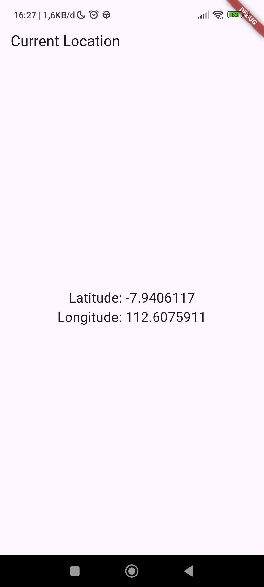

### Langkah 8: Tambahkan animasi loading
```dart
@override
Widget build(BuildContext context) {
  final myWidget = myPosition == ''
      ? const CircularProgressIndicator()
      : Text(
          myPosition,
          textAlign: TextAlign.center,
          style: const TextStyle(fontSize: 20),
        );

  return Scaffold(
    appBar: AppBar(
      title: const Text('Current Location'),
    ),
    body: Center(
      child: myWidget,
    ),
  );
}
```

### **Soal 12**
**Jika Anda tidak melihat animasi loading tampil, kemungkinan itu berjalan sangat cepat. Tambahkan delay pada method getPosition() dengan kode await Future.delayed(const Duration(seconds: 3));**
``` dart
Future<Position> getPosition() async {
  await Geolocator.requestPermission();
  await Geolocator.isLocationServiceEnabled();
  await Future.delayed(const Duration(seconds: 3));
  Position position = await Geolocator.getCurrentPosition();
  return position;
}
```

**Apakah Anda mendapatkan koordinat GPS ketika run di browser? Mengapa demikian?**

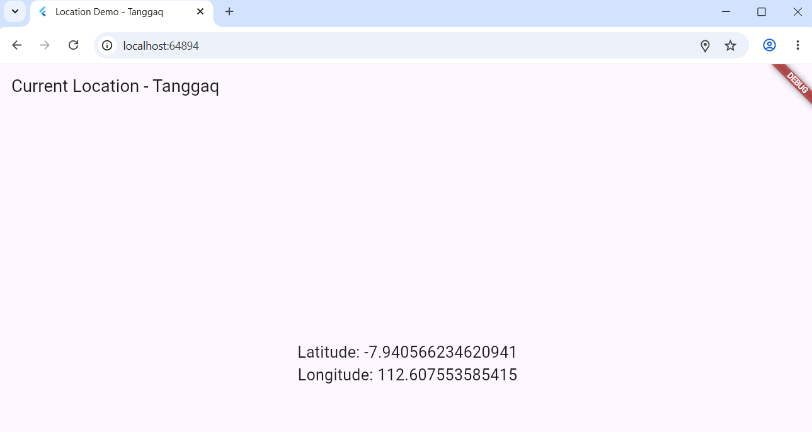

Browser modern mendukung Geolocation API yang memungkinkan aplikasi web, termasuk Flutter web, mengakses lokasi pengguna melalui package geolocator. Namun, akurasi GPS di browser jauh lebih rendah dibanding mobile karena mengandalkan IP geolocation dan WiFi positioning daripada hardware GPS—biasanya hanya akurat hingga ratusan meter. Selain itu, API ini hanya bekerja di HTTPS atau localhost dan memerlukan izin pengguna, sehingga koordinat yang didapat sering menunjukkan lokasi ISP/provider internet daripada lokasi fisik sebenarnya.

**Capture hasil praktikum Anda berupa GIF dan lampirkan di README**

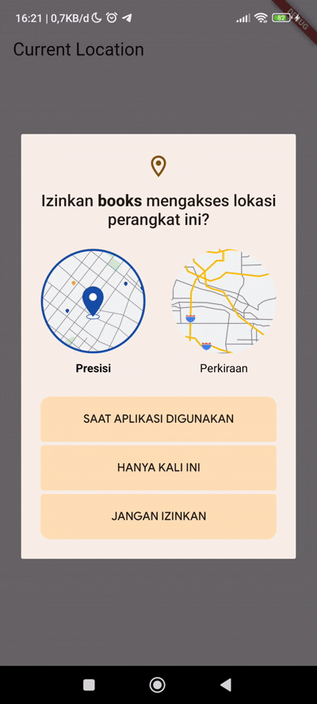

## Praktikum 7: Manajemen Future dengan FutureBuilder

### Langkah 1: Modifikasi method getPosition()

### Langkah 2: Tambah variabel

### Langkah 3: Tambah initState()

### Langkah 4: Edit method build()

### **Soal 13**
**Apakah ada perbedaan UI dengan praktikum sebelumnya? Mengapa demikian?, Capture hasil praktikum Anda berupa GIF dan lampirkan di README**

Ya, Perbedaan UI antara Praktikum 6 dan Praktikum 7 terletak pada loading indicator. Praktikum 6 menggunakan .then() dengan manual setState() sehingga tidak ada loading indicator, layar kosong/blank selama 3 detik, dan koordinat muncul tiba-tiba setelah loading selesai. 

Sementara pada Praktikum 7 menggunakan FutureBuilder yang otomatis mendeteksi ConnectionState, sehingga ada CircularProgressIndicator saat loading, user dapat melihat feedback visual yang jelas, dan transisi smooth dari loading ke data.

Outputnya


### Langkah 5: Tambah handling error

### Hasil Keseluruhan : 
``` dart
import 'package:flutter/material.dart';
import 'package:geolocator/geolocator.dart';

class LocationScreen extends StatefulWidget {
  const LocationScreen({super.key});

  @override
  State<LocationScreen> createState() => _LocationScreenState();
}

class _LocationScreenState extends State<LocationScreen> {
  // Langkah 2: Tambah variabel Future
  Future<Position>? position;

  // Langkah 3: InitState
  @override
  void initState() {
    super.initState();

    position = getPosition();
  }

  // Langkah 4: FutureBuilder
  @override
  Widget build(BuildContext context) {
    return Scaffold(
      appBar: AppBar(
        title: const Text('Current Location - Tanggaq'),
      ),
      body: Center(
        child: FutureBuilder<Position>(
          future: position,
          builder:
              (BuildContext context, AsyncSnapshot<Position> snapshot) {
            // Loading
            if (snapshot.connectionState == ConnectionState.waiting) {
              return const CircularProgressIndicator();
            }

            // Jika selesai
            else if (snapshot.connectionState ==
                ConnectionState.done) {

              // Langkah 5: Handling Error
              if (snapshot.hasError) {
                return const Text(
                  'Something terrible happened!',
                  style: TextStyle(fontSize: 18),
                );
              }

              // Jika berhasil
              return Text(
                'Latitude: ${snapshot.data!.latitude}\n'
                'Longitude: ${snapshot.data!.longitude}',
                textAlign: TextAlign.center,
                style: const TextStyle(fontSize: 20),
              );
            }

            // Kondisi default
            else {
              return const Text('');
            }
          },
        ),
      ),
    );
  }

  // Langkah 1: Method getPosition()
  Future<Position> getPosition() async {
    await Geolocator.requestPermission();
    await Geolocator.isLocationServiceEnabled();
    await Future.delayed(const Duration(seconds: 3));
    Position position = await Geolocator.getCurrentPosition();
    return position;
  }
}
```

### **Soal 14**
**Apakah ada perbedaan UI dengan langkah sebelumnya? Mengapa demikian?, Capture hasil praktikum Anda berupa GIF dan lampirkan di README**

Tidak ada perbedaan UI yang terlihat setelah menambahkan error handling karena getPosition() berjalan sukses tanpa error, sehingga kode snapshot.hasError tidak akan terpicu. Pesan "Something terrible happened!" hanya akan ditampilkan jika terjadi error seperti permission ditolak atau GPS tidak aktif. Dalam kondisi normal, FutureBuilder menampilkan CircularProgressIndicator saat ConnectionState.waiting, kemudian secara otomatis beralih menampilkan koordinat saat ConnectionState.done tanpa error. Dengan demikian, error handling berfungsi sebagai safety net yang siap menangani situasi error jika terjadi, namun tidak mengubah alur UI yang sudah berjalan normal.

Outputnya


## Praktikum 8: Navigation route dengan Future Function

### Langkah 1: Buat file baru navigation_first.dart

### Langkah 2: Isi kode navigation_first.dart

### **Soal 15**
**Tambahkan nama panggilan Anda pada tiap properti title sebagai identitas pekerjaan Anda, Silakan ganti dengan warna tema favorit Anda.**

### Langkah 3: Tambah method di class _NavigationFirstState

### Kode Program Keseluruhan di navigation_first.dart : 
``` dart
import 'package:flutter/material.dart';
import 'navigation_second.dart';

class NavigationFirst extends StatefulWidget {
  const NavigationFirst({super.key});

  @override
  State<NavigationFirst> createState() => NavigationFirstState();
}

class NavigationFirstState extends State<NavigationFirst> {
  Color color = Colors.blue.shade700;

  @override
  Widget build(BuildContext context) {
    return Scaffold(
      backgroundColor: color,
      appBar: AppBar(
        title: const Text('Navigation First Screen - Tanggaq'),
      ),
      body: Center(
        child: ElevatedButton(
          child: const Text('Change Color'),
          onPressed: () {
            _navigateAndGetColor(context);
          },
        ),
      ),
    );
  }

  Future<void> _navigateAndGetColor(BuildContext context) async {
    color =
        await Navigator.push(
              context,
              MaterialPageRoute(
                builder: (context) => const NavigationSecond(),
              ),
            ) ??
            Colors.blue;

    setState(() {});
  }
}
```

### Langkah 4: Buat file baru navigation_second.dart

### Langkah 5: Buat class NavigationSecond dengan StatefulWidget
``` dart
import 'package:flutter/material.dart';

class NavigationSecond extends StatefulWidget {
  const NavigationSecond({super.key});

  @override
  State<NavigationSecond> createState() => _NavigationSecondState();
}

class _NavigationSecondState extends State<NavigationSecond> {
  @override
  Widget build(BuildContext context) {
    Color color;

    return Scaffold(
      appBar: AppBar(
        title: const Text('Navigation Second Screen'),
      ),
      body: Center(
        child: Column(
          mainAxisAlignment: MainAxisAlignment.spaceEvenly,
          children: [
            ElevatedButton(
              child: const Text('Red'),
              onPressed: () {
                color = Colors.red.shade700;

                Navigator.pop(context, color);
              },
            ),

            ElevatedButton(
              child: const Text('Green'),
              onPressed: () {
                color = Colors.green.shade700;

                Navigator.pop(context, color);
              },
            ),

            ElevatedButton(
              child: const Text('Blue'),
              onPressed: () {
                color = Colors.blue.shade700;

                Navigator.pop(context, color);
              },
            ),
          ],
        ),
      ),
    );
  }
}
```

### Langkah 6: Edit main.dart
``` dart
home: const NavigationFirst(),
```

### Langkah 7: Run

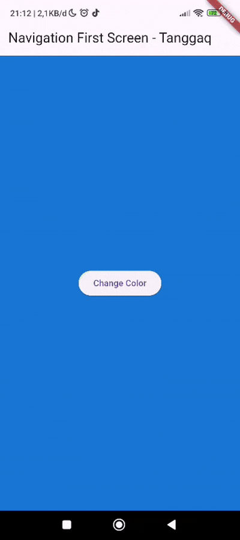

### **Soal 16**
**Cobalah klik setiap button, apa yang terjadi ? Mengapa demikian ?**

Ketika button diklik (Red/Green/Blue), aplikasi akan menutup halaman kedua (NavigationSecond) dan kembali ke halaman pertama (NavigationFirst) dengan background halaman pertama berubah sesuai warna button yang dipilih. 

Hal ini terjadi karena setiap button memanggil Navigator.pop(context, color) yang mengirim data warna kembali ke halaman sebelumnya, kemudian method _navigateAndGetColor() di halaman pertama menerima warna tersebut melalui await Navigator.push() dan memanggil setState() untuk update background dengan warna

**Gantilah 3 warna pada langkah 5 dengan warna favorit Anda!, Capture hasil praktikum Anda berupa GIF dan lampirkan di README.**

Code
``` dart
children: [
  ElevatedButton(
    child: const Text('Cream'),
    onPressed: () {
      color = Colors.amber.shade100;

      Navigator.pop(context, color);
    },
  ),

  ElevatedButton(
    child: const Text('Green'),
    onPressed: () {
      color = Colors.green.shade700;

      Navigator.pop(context, color);
    },
  ),

  ElevatedButton(
    child: const Text('Brown'),
    onPressed: () {
      color = Colors.brown.shade400;

      Navigator.pop(context, color);
    },
  ),
],
```

Outpunya

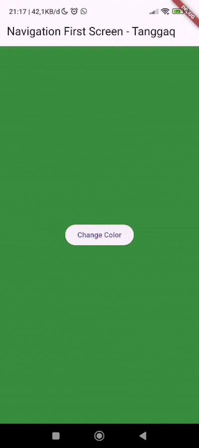

## Praktikum 9: Memanfaatkan async/await dengan Widget Dialog

### Langkah 1: Buat file baru navigation_dialog.dart

### Langkah 2: Isi kode navigation_dialog.dart

### Langkah 3: Tambah method async

### Langkah 4: Panggil method di ElevatedButton

### Langkah 5: Edit main.dart
``` dart
home: const NavigationDialogScreen(),
```

### Langkah 6: Run

### Kode Program : 
``` dart
import 'package:flutter/material.dart';

class NavigationDialogScreen extends StatefulWidget {
  const NavigationDialogScreen({super.key});

  @override
  State<NavigationDialogScreen> createState() =>
      _NavigationDialogScreenState();
}

class _NavigationDialogScreenState extends State<NavigationDialogScreen> {
  Color color = Colors.blue.shade700;

  @override
  Widget build(BuildContext context) {
    return Scaffold(
      backgroundColor: color,
      appBar: AppBar(
        title: const Text('Navigation Dialog Screen - Tanggaq'),
      ),
      body: Center(
        child: ElevatedButton(
          child: const Text('Change Color'),
          onPressed: () {
            _showColorDialog(context);
          },
        ),
      ),
    );
  }

  Future<void> _showColorDialog(BuildContext context) async {
    color = await showDialog<Color>(
          barrierDismissible: false,
          context: context,
          builder: (BuildContext context) {
            return AlertDialog(
              title: const Text('Very important question'),
              content: const Text('Please choose a color'),
              actions: <Widget>[
                TextButton(
                  child: const Text('Red'),
                  onPressed: () {
                    Navigator.pop(context, Colors.red.shade700);
                  },
                ),
                TextButton(
                  child: const Text('Green'),
                  onPressed: () {
                    Navigator.pop(context, Colors.green.shade700);
                  },
                ),
                TextButton(
                  child: const Text('Blue'),
                  onPressed: () {
                    Navigator.pop(context, Colors.blue.shade700);
                  },
                ),
              ],
            );
          },
        ) ??
        Colors.blue.shade700;

    setState(() {});
  }
}
```

### **Soal 17**
**Cobalah klik setiap button, apa yang terjadi ? Mengapa demikian ?**

Ketika button "Change Color" diklik, muncul AlertDialog dengan 3 pilihan warna (Red/Green/Blue), dan setelah memilih warna, dialog tertutup serta background halaman berubah sesuai warna yang dipilih.

Hal ini terjadi karena method _showColorDialog() menampilkan dialog dengan showDialog() yang memiliki barrierDismissible: false sehingga dialog hanya bisa ditutup dengan klik button, kemudian setiap TextButton memanggil Navigator.pop(context, color) untuk menutup dialog dan mengirim warna, dan setelah await showDialog() selesai, setState() dipanggil untuk update background

Perbedaan dengan Praktikum 8:

- Praktikum 8: Navigasi ke halaman baru (full screen)
- Praktikum 9: Menampilkan dialog (popup overlay)

**Gantilah 3 warna pada langkah 3 dengan warna favorit Anda!, Capture hasil praktikum Anda berupa GIF dan lampirkan di README**

Outputnya

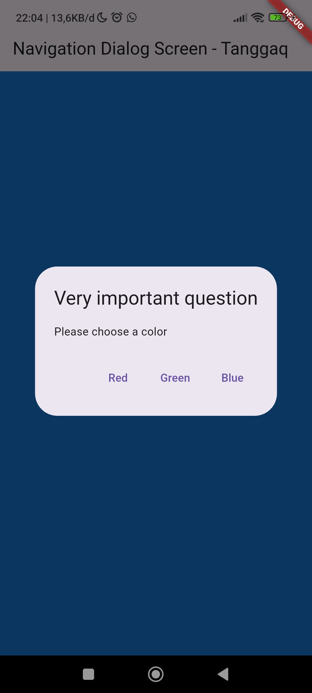

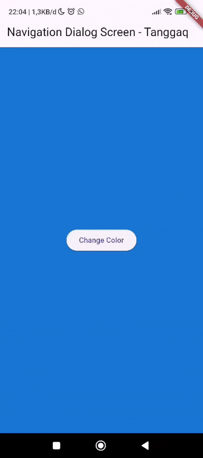