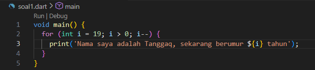
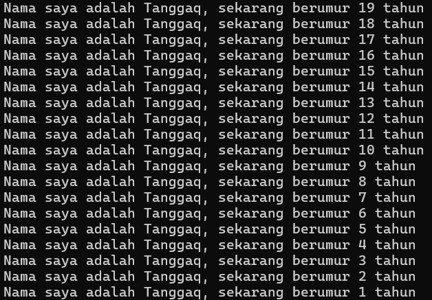
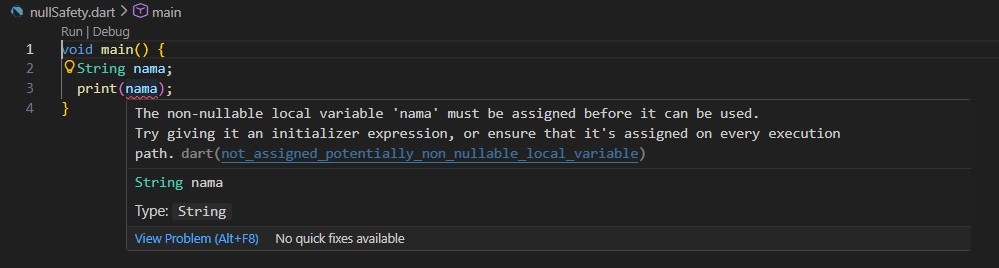
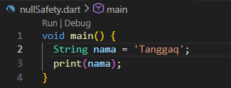
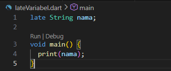
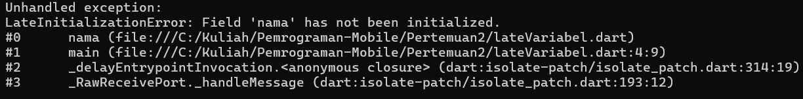
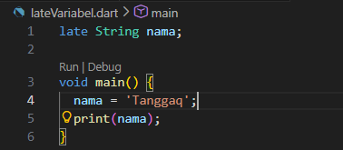
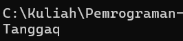

# Laporan Praktikum #02 - Pemrograman Dasar Dart - Bag.1 (Variabel dan Tipe Data)

## Identitas Mahasiswa

| Atribut | Nilai                           |
| ------- | -----                           |
| Nama    | Mochammad Tanggaq Dirat Saputra |
| NIM     | 244107060126                    |
| Kelas   | SIB-2D                          |

---

## Tugas Praktikum 2

### Soal 1

Modifikasilah kode pada baris 3 di VS Code atau Editor Code favorit Anda berikut ini agar mendapatkan keluaran (output) sesuai yang diminta!

```dart
void main() {
  for (int i = 0; i < 10; i++) {
    print("Hello ${i + 2}");
  }
}
```

**Jawab:**





---

### Soal 2

Mengapa sangat penting untuk memahami bahasa pemrograman Dart sebelum kita menggunakan framework Flutter? Jelaskan!

**Jawab:**

Framework Flutter dibangun sepenuhnya menggunakan bahasa pemrograman Dart. Artinya, semua kode yang kita tulis saat membuat aplikasi Flutter menggunakan Dart. Berikut alasan mengapa memahami Dart itu sangat penting :
1. **Dasar Penulisan Kode Flutter** 
semua widget, logika aplikasi, navigasi, hingga pengolahan data ditulis dengan sintaks Dart. Tanpa memahami Dart, kita akan kesulitan membaca maupun menulis kode Flutter.
2. **Memahami Konsep OOP (Object-Oriented Programming)**
dart menggunakan konsep OOP seperti class, object, inheritance, encapsulation, dan polymorphism. Flutter sendiri berbasis class (contohnya StatelessWidget dan StatefulWidget), sehingga pemahaman OOP sangat dibutuhkan.
3. **Pengelolaan State dan Logika Aplikasi**
pengaturan state (state management) dalam Flutter sangat bergantung pada pemahaman fungsi, variabel, async/await, future, dan stream di Dart
4. **Debugging Lebih Mudah**
jika terjadi error, memahami struktur dan cara kerja Dart akan membantu kita membaca pesan error dan memperbaikinya dengan cepat
5. **Optimasi dan Performa Aplikasi**
pemahaman tipe data, null safety, dan asynchronous programming di Dart membantu membuat aplikasi lebih aman, stabil, dan efisien.

---

### Soal 3

Rangkumlah materi dari codelab ini menjadi poin-poin penting yang dapat Anda gunakan untuk membantu proses pengembangan aplikasi mobile menggunakan framework Flutter.

**Jawab:**

1. Flutter memakai Dart sebagai bahasa utama untuk membangun tampilan (widget) dan logika aplikasi.
2. Dart menyediakan alat pengembangan yang lengkap, memiliki garbage collector, dan menjaga kode tetap aman lewat type safety.
3. Dart bersifat statically typed dan mendukung type inference
4. Dart dapat dikompilasi menggunakan 
    - Dart Virtual Machine (VM)
    - kompilasi ke JavaScript (dart2js)
5. Dart mendukung mode kompilasi yaitu
    - JIT (untuk pengembangan & hot reload)
    - AOT (untuk performa saat rilis)
6. Hot reload memungkinkan perubahan kode langsung terlihat tanpa restart aplikasi
7. Dart mendukung konsep OOP, class, object
8. Dart memiliki operator aritmatika, relasional, logika, serta increment/decrement
9. Flutter berbasis widget tree, artinya semua tampilan adalah widget yang tersusun secara hierarki.
10. Flutter mendukung pembuatan aplikasi lintas platform (Android, iOS, Web, Desktop) dari satu codebase menggunakan framework Flutter.

---

### Soal 4

Buatlah penjelasan dan contoh eksekusi kode tentang perbedaan Null Safety dan Late variabel!

**Jawab:**

#### Null Safety

Null Safety adalah fitur Dart yang mencegah variabel bernilai null secara tidak sengaja, sehingga mengurangi error saat program berjalan (runtime error).

Contohnya



Kenapa error? karena variabel nama belum ada nilainya

Solusinya yaitu kita bisa mengisi variable tersebut seperti ini



atau bisa juga dengan menambahkan "?" jadi nanti outputnya akan null

#### Late Variabel

Late variable digunakan untuk menunda pengisian nilai variabel. Dengan late, programmer berjanji bahwa variabel akan diisi sebelum digunakan. Jika tidak, program akan mengalami error saat dijalankan.

Contohnya



walaupun codenya tidak error, pada saat kita run akan muncul error "LateInitializationError" karena kita belum mengisi variable namanya

Solusinya yaitu mengisi variabel nama seperti berikut





Jadi kesimpulannya adalah
Null Safety digunakan untuk variabel yang boleh bernilai null, sedangkan late digunakan untuk variabel yang tidak boleh null tetapi diisi belakangan, dengan syarat harus diinisialisasi sebelum digunakan agar tidak terjadi error.