# Laporan Praktikum #03 | Pengantar Bahasa Pemrograman Dart - Bagian 2

## Identitas Mahasiswa

| Atribut | Nilai                           |
| ------- | -----                           |
| Nama    | Mochammad Tanggaq Dirat Saputra |
| NIM     | 244107060126                    |
| Kelas   | SIB-2D                          |
---

# Tugas Praktikum 3

# Soal 1
Silakan selesaikan Praktikum 1 sampai 3, lalu dokumentasikan berupa screenshot hasil pekerjaan beserta penjelasannya!

## Praktikum 1
### Langkah 1 :

Ketik atau salin kode program berikut ke dalam fungsi `main()`.

```dart
String test = "test2";
if (test == "test1") {
   print("Test1");
} else If (test == "test2") {
   print("Test2");
} Else {
   print("Something else");
}

if (test == "test2") print("Test2 again");
```

### Langkah 2:

Silakan coba eksekusi (Run) kode pada langkah 1 tersebut. Apa yang terjadi? Jelaskan!

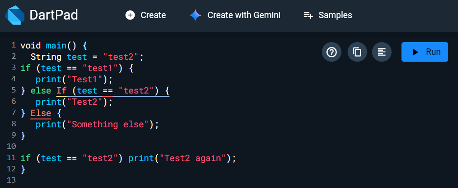

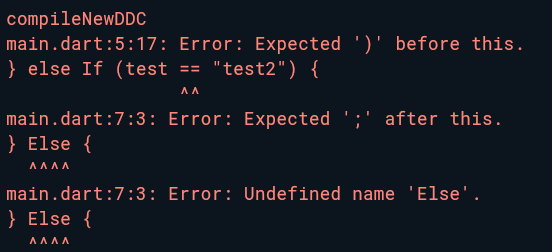

Terjadi error karena pada baris 5 penulisan 'If' menggunakan awalan kapital, dan pada baris 7 penulisan 'Else' menggunakan awalan kapital. Seharusnya, penulisan 'if' maupun 'else' menggunakan huruf kecil semua agar tidak terjadi error

### Langkah 3:

Tambahkan kode program berikut, lalu coba eksekusi (Run) kode Anda.

```dart
String test = "true";
if (test) {
   print("Kebenaran");
}
```

Apa yang terjadi ? Jika terjadi error, silakan perbaiki namun tetap menggunakan if/else

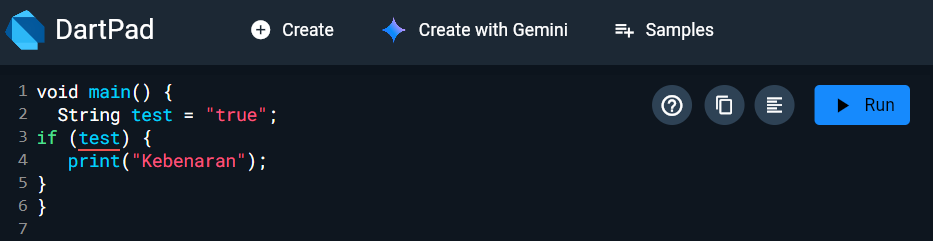

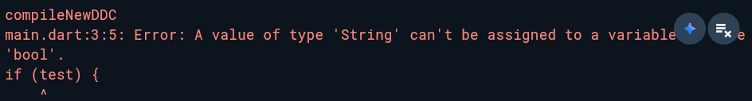


Error muncul karena test bertipe String. Pada Dart, syarat if harus berupa nilai boolean, jadi String tidak bisa dipakai langsung sebagai kondisi.


Perbaikannya

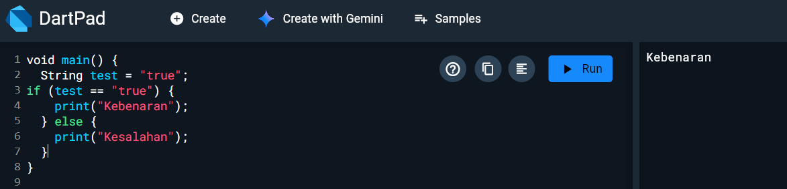

Maka akan muncul 'Kebenaran' sebagai output

## Praktikum 2
### Langkah 1:

Ketik atau salin kode program berikut ke dalam fungsi `main()`.

```dart
while (counter < 33) {
  print(counter);
  counter++;
}
```

### Langkah 2:

Silakan coba eksekusi (Run) kode pada langkah 1 tersebut. Apa yang terjadi? Jelaskan! Lalu perbaiki jika terjadi error.

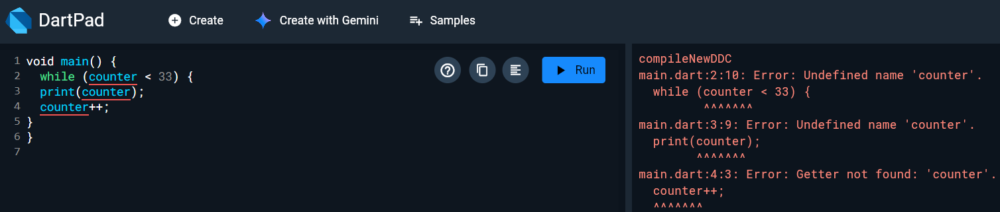

Terjadi error karena variabel counter belum dideklarasikan sebelum digunakan di dalam loop while

Perbaikan !

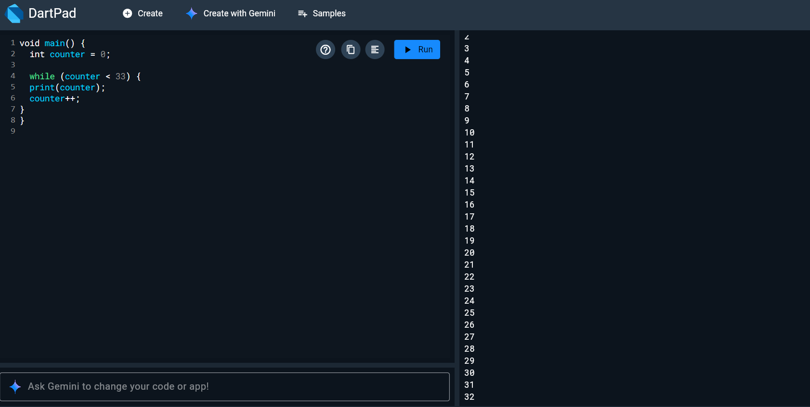

### Langkah 3:

Tambahkan kode program berikut, lalu coba eksekusi (Run) kode Anda.

```dart
do {
  print(counter);
  counter++;
} while (counter < 77);
```

Apa yang terjadi ? Jika terjadi error, silakan perbaiki namun tetap menggunakan *do-while*.

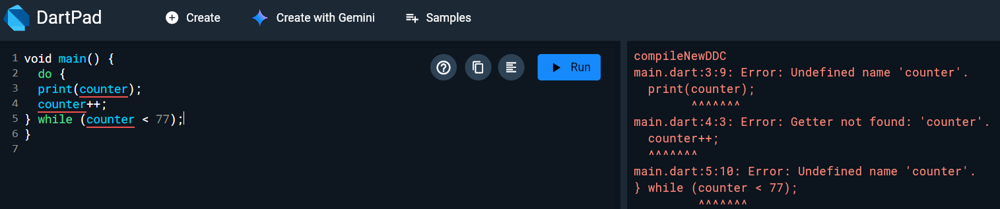

Errornya sama seperti sebelumnya yaitu variabel counter belum di deklarasikan maka dari itu terjadi error

Perbaikan!!

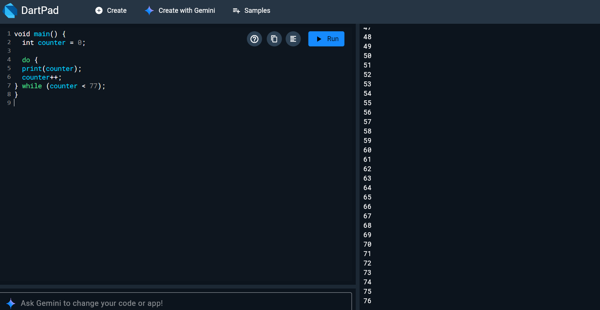

## Praktikum 3
### Langkah 1:

Ketik atau salin kode program berikut ke dalam fungsi `main()`.

```dart
for (Index = 10; index < 27; index) {
  print(Index);
}
```

### Langkah 2:

Silakan coba eksekusi (Run) kode pada langkah 1 tersebut. Apa yang terjadi? Jelaskan! Lalu perbaiki jika terjadi error.

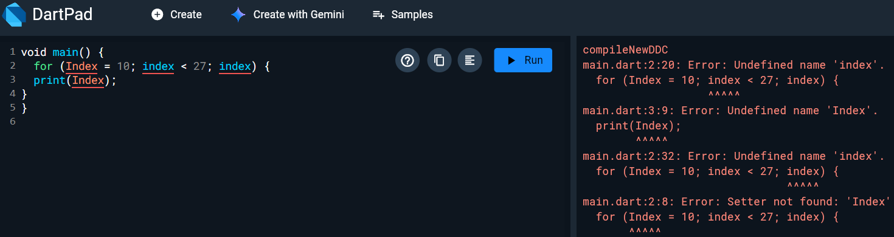

Kesalahan muncul karena index belum memiliki tipe data, penulisannya salah (harusnya index bukan Index), dan di baris 2 tidak ada ++ setelah index.
Perbaikan dilakukan dengan menambahkan tipe data, mengubah penulisan ke index, serta menambahkan ++ di akhir baris kedua.


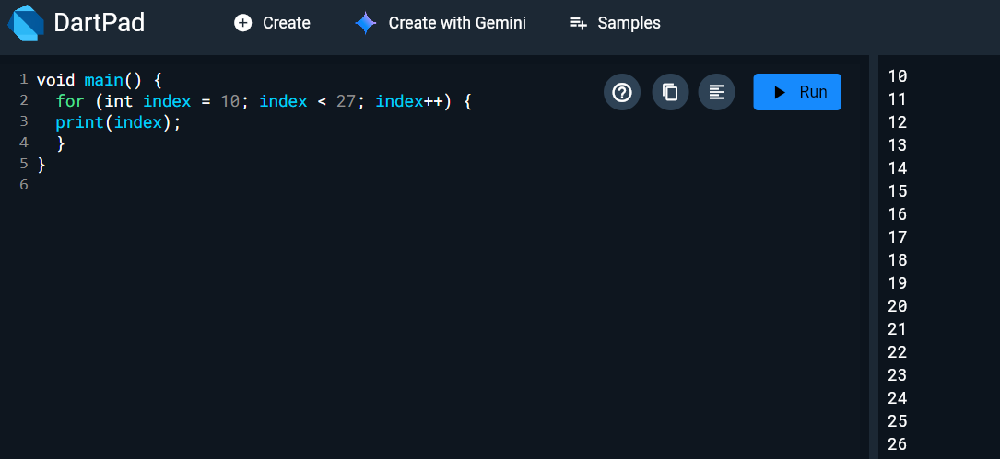

### Langkah 3:

Tambahkan kode program berikut di dalam *for-loop*, lalu coba eksekusi (Run) kode Anda.

```dart
If (Index == 21) break;
Else If (index > 1 || index < 7) continue;
print(index);
```

Apa yang terjadi ? Jika terjadi error, silakan perbaiki namun tetap menggunakan *for* dan *break-continue*.

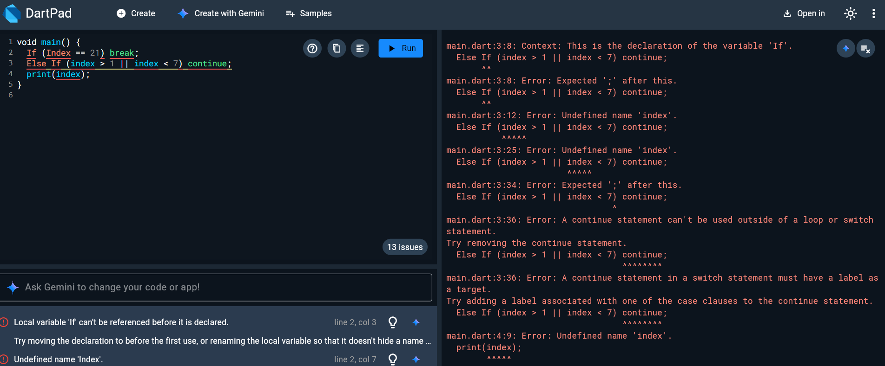

Kesalahan terjadi karena If dan Else If ditulis dengan huruf kapital, padahal Dart hanya mengenali if dan else if. Ada juga warning karena blok kondisi tidak memakai {}. Selain itu, operator || membuat kondisi selalu benar, sehingga print tidak pernah dieksekusi.
Solusinya: ubah penulisan ke huruf kecil, tambahkan {} pada setiap blok, dan ganti || dengan && agar program mencetak angka 10–20 lalu berhenti di 21 karena adanya break.

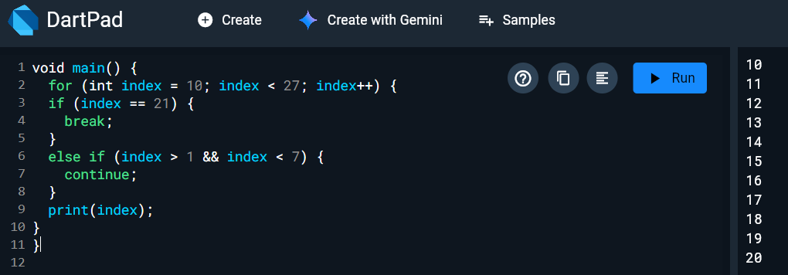

# Soal 2
Buatlah sebuah program yang dapat menampilkan bilangan prima dari angka 0 sampai 201 menggunakan Dart. Ketika bilangan prima ditemukan, maka tampilkan nama lengkap dan NIM Anda.

Code Program + Output

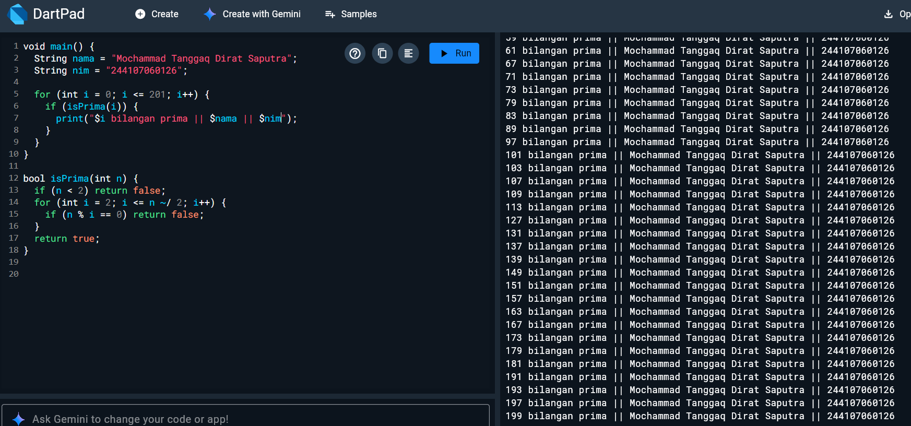
