# Laporan Praktikum #04 | Pengantar Bahasa Pemrograman Dart - Bagian 3

## Identitas Mahasiswa

| Atribut | Nilai                           |
| ------- | -----                           |
| Nama    | Mochammad Tanggaq Dirat Saputra |
| NIM     | 244107060126                    |
| Kelas   | SIB-2D                          |
---------------------------------------------

# Tugas Praktikum 4

# Percobaan 1 : Eksperimen Tipe Data List

## Langkah 1

Ketik atau salin kode program berikut ke dalam void `main()`.

```dart
var list = [1, 2, 3];
assert(list.length == 3);
assert(list[1] == 2);
print(list.length);
print(list[1]);
list[1] = 1;
assert(list[1] == 1);
print(list[1]);
```
## Langkah 2 

Silakan coba eksekusi (Run) kode pada langkah 1 tersebut. Apa yang terjadi? Jelaskan!

Jawab :

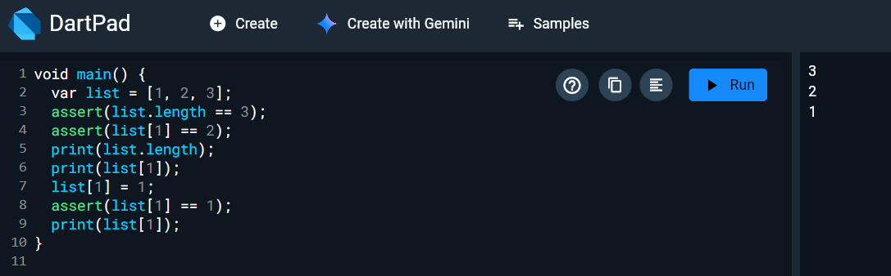

Saat program dijalankan, dibuat sebuah list [1, 2, 3] yang memiliki panjang 3, sehingga print(list.length) menampilkan 3. Kemudian print(list[1]) menampilkan nilai pada indeks ke-1, yaitu 2. Setelah itu nilai pada indeks ke-1 diubah menjadi 1 dengan list[1] = 1, sehingga ketika dicetak kembali dengan print(list[1]), outputnya menjadi 1.

## Langkah 3

Ubah kode pada langkah 1 menjadi variabel final yang mempunyai index = 5 dengan default value = null. Isilah nama dan NIM Anda pada elemen index ke-1 dan ke-2. Lalu print dan capture hasilnya.

Apa yang terjadi ? Jika terjadi error, silakan perbaiki

Jawab : 

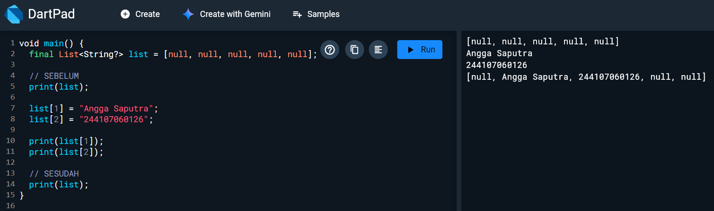

Terjadi error karena list dibuat dengan nilai awal "Null" sehingga Dart menganggap tipe list adalah List <Null> (hanya boleh berisi null). Ketika diisi dengan "Angga Saputra" dan "12345678" yang bertipe String, maka program menjadi error. Saya memperbaiki dengan menentukan tipe list agar dapat berisi "String" dan "Null".


# Percobaan 2 : Eksperimen Tipe Data Set

## Langkah 1 

Ketik atau salin kode program berikut ke dalam fungsi main().

```dart
var halogens = {'fluorine', 'chlorine', 'bromine', 'iodine', 'astatine'};
print(halogens);
```

## Langkah 2 

Silakan coba eksekusi (Run) kode pada langkah 1 tersebut. Apa yang terjadi? Jelaskan! Lalu perbaiki jika terjadi error.

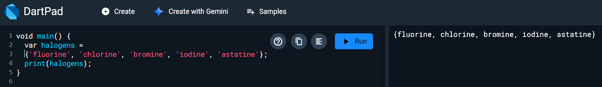

Ketika kode dijalankan, program akan menampilkan isi set halogens yang berisi lima elemen yaitu 'fluorine', 'chlorine', 'bromine', 'iodine', dan 'astatine'. Tipe data yang digunakan adalah Set, yaitu kumpulan data yang tidak memiliki indeks dan tidak boleh ada data yang duplikat.

## Langkah 3

Tambahkan kode program berikut, lalu coba eksekusi (Run) kode Anda.

```dart
var names1 = <String>{};
Set<String> names2 = {}; // This works, too.
var names3 = {}; // Creates a map, not a set.

print(names1);
print(names2);
print(names3);
```

Apa yang terjadi ? Jika terjadi error, silakan perbaiki namun tetap menggunakan ketiga variabel tersebut. Tambahkan elemen nama dan NIM Anda pada kedua variabel Set tersebut dengan dua fungsi berbeda yaitu .add() dan .addAll(). Untuk variabel Map dihapus, nanti kita coba di praktikum selanjutnya.

Jawab : 

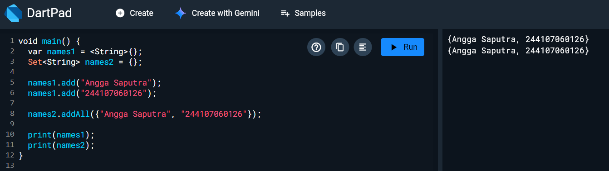

Ketika kode dijalankan, names1 dan names2 akan menjadi Set, sedangkan names3 menjadi Map, bukan Set. Hal ini karena penulisan {} tanpa tipe data dianggap sebagai Map oleh Dart.

# Percobaan 3 : Eksperimen Tipe Data Maps

## Langkah 1 

Ketik atau salin kode program berikut ke dalam fungsi main().

```dart
var gifts = {
  // Key:    Value
  'first': 'partridge',
  'second': 'turtledoves',
  'fifth': 1
};

var nobleGases = {
  2: 'helium',
  10: 'neon',
  18: 2,
};

print(gifts);
print(nobleGases);
```

## Langkah 2

Silakan coba eksekusi (Run) kode pada langkah 1 tersebut. Apa yang terjadi? Jelaskan! Lalu perbaiki jika terjadi error.

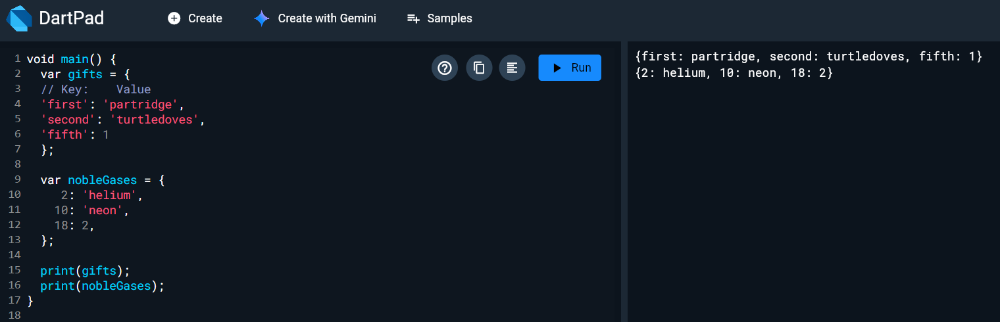

Program tidak error, ketika kode dijalankan program akan menampilkan isi dua buah Map yaitu 'gifts' dan 'nobleGases'. Map adalah struktur data yang menyimpan pasangan key dan value. Pada 'gifts', key berupa 'String', sedangkan pada 'nobleGases', key berupa 'angka (int)'.

## Langkah 3

Tambahkan kode program berikut, lalu coba eksekusi (Run) kode Anda.

```dart
var mhs1 = Map<String, String>();
gifts['first'] = 'partridge';
gifts['second'] = 'turtledoves';
gifts['fifth'] = 'golden rings';

var mhs2 = Map<int, String>();
nobleGases[2] = 'helium';
nobleGases[10] = 'neon';
nobleGases[18] = 'argon';
```

Apa yang terjadi ? Jika terjadi error, silakan perbaiki.

Tambahkan elemen nama dan NIM Anda pada tiap variabel di atas (gifts, nobleGases, mhs1, dan mhs2). Dokumentasikan hasilnya dan buat laporannya!

Jawab : 

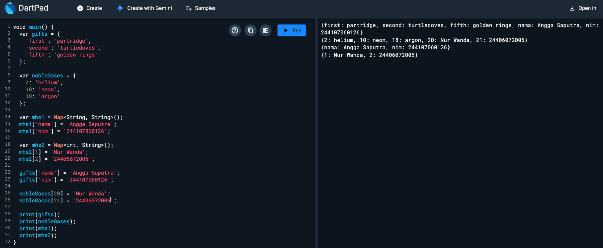

Ketika kode dijalankan, program menambahkan pasangan key–value pada Map gifts dan nobleGases, serta membuat dua Map baru yaitu mhs1 (key dan value bertipe String) dan mhs2 (key bertipe int dan value bertipe String). Selanjutnya nama dan NIM ditambahkan ke setiap Map, kemudian seluruh data ditampilkan menggunakan print().

# Percobaan 4: Eksperimen Tipe Data List: Spread dan Control-flow Operators

## Langkah 1

Ketik atau salin kode program berikut ke dalam fungsi main().

```dart
var list = [1, 2, 3];
var list2 = [0, ...list];
print(list1);
print(list2);
print(list2.length);
```

## Langkah 2

Silakan coba eksekusi (Run) kode pada langkah 1 tersebut. Apa yang terjadi? Jelaskan! Lalu perbaiki jika terjadi error.

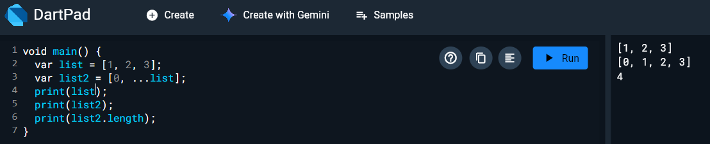

Ketika kode dijalankan terjadi error, karena program mencoba mencetak list1, padahal variabel tersebut tidak pernah dibuat. Variabel yang ada hanya list dan list2. Maka perbaikan yang saya lakukan adalah merubah 'list1' menjadi 'list'.

## Langkah 3

Tambahkan kode program berikut, lalu coba eksekusi (Run) kode Anda.

```dart
list1 = [1, 2, null];
print(list1);
var list3 = [0, ...?list1];
print(list3.length);
```

Apa yang terjadi ? Jika terjadi error, silakan perbaiki. Tambahkan variabel list berisi NIM Anda menggunakan Spread Operators. Dokumentasikan hasilnya dan buat laporannya!

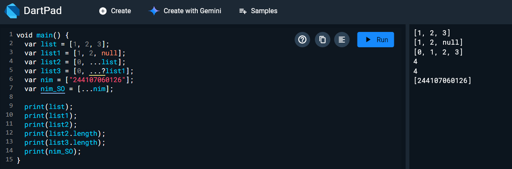

Ketika kode dijalankan terjadi error karena list1 tidak diberi tipe data, kemudian saya perbaiki dengan menambahkan tipe data 'var'. Kemudian dibuat list3 dengan Spread Operator ...?, yang berfungsi untuk menyebarkan elemen dari list1 ke dalam list baru dan tetap aman jika nilainya null. Setelah itu program mencetak panjang list3. Kemudian ditambahkan variabel list yang berisi NIM dan digabungkan menggunakan Spread Operator (...).

## Langkah 4

Tambahkan kode program berikut, lalu coba eksekusi (Run) kode Anda.

```dart
var nav = ['Home', 'Furniture', 'Plants', if (promoActive) 'Outlet'];
print(nav);
```

Apa yang terjadi ? Jika terjadi error, silakan perbaiki. Tunjukkan hasilnya jika variabel promoActive ketika true dan false.

Jawab : 

### Jika TRUE

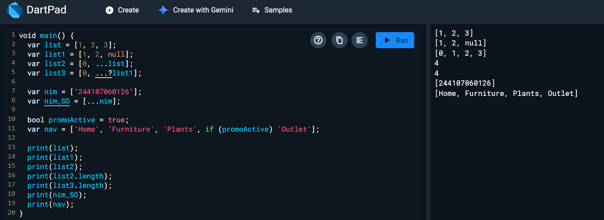

### Jika FALSE

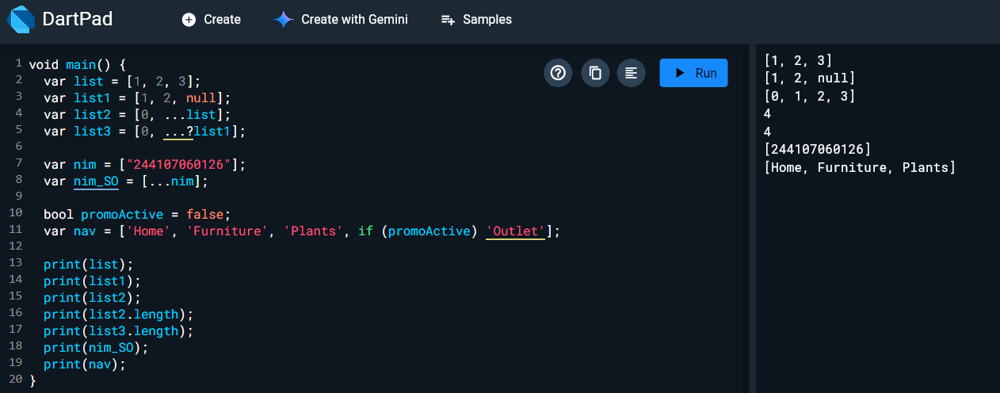

Ketika kode dijalankan akan terjadi error, karena variabel promoActive belum dideklarasikan. Oleh karena itu kita harus membuat variabel tersebut terlebih dahulu dengan tipe bool.

## Langkah 5

Tambahkan kode program berikut, lalu coba eksekusi (Run) kode Anda.

```dart
var nav2 = ['Home', 'Furniture', 'Plants', if (login case 'Manager') 'Inventory'];
print(nav2);
```

Apa yang terjadi ? Jika terjadi error, silakan perbaiki. Tunjukkan hasilnya jika variabel login mempunyai kondisi lain.

Jawab : 

### Jika kondisi MANAGER

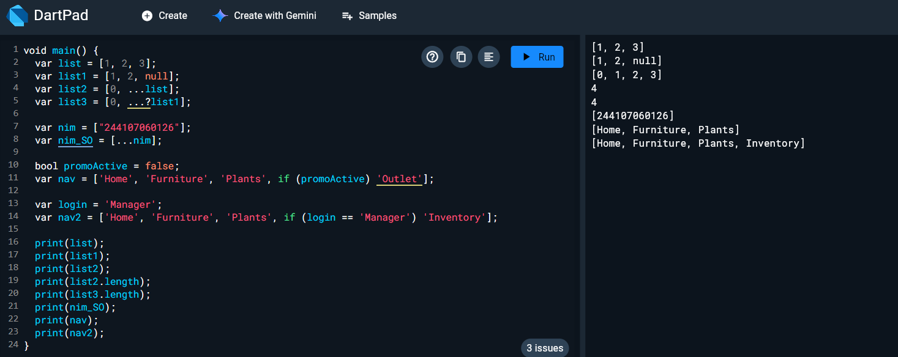

### Jika kondisi USER

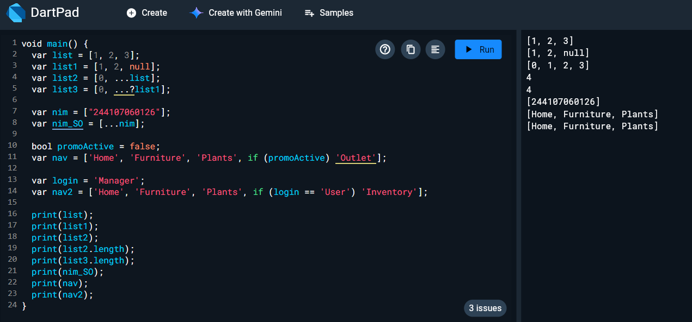

Kode tersebut menggunakan kondisi if di dalam list. Jika nilai variabel login adalah 'Manager', maka elemen 'Inventory' akan ditambahkan ke dalam list. Jika bukan 'Manager', maka elemen tersebut tidak akan dimasukkan.

## Langkah 6 

Tambahkan kode program berikut, lalu coba eksekusi (Run) kode Anda.

```dart
var listOfInts = [1, 2, 3];
var listOfStrings = ['#0', for (var i in listOfInts) '#$i'];
assert(listOfStrings[1] == '#1');
print(listOfStrings);
```

Apa yang terjadi ? Jika terjadi error, silakan perbaiki. Jelaskan manfaat Collection For dan dokumentasikan hasilnya.

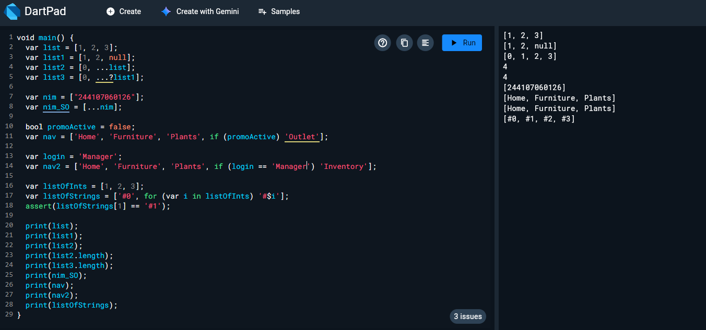

Jawab : 

Ketika kode dijalankan, program membuat listOfInts = [1, 2, 3] lalu menggunakan Collection For untuk membuat listOfStrings yang berisi '#0' dan hasil perulangan '#1', '#2', '#3'. Program berjalan tanpa error dan assert memastikan bahwa elemen indeks ke-1 bernilai '#1'. Collection For bermanfaat untuk menambahkan elemen ke koleksi dengan perulangan secara lebih singkat dan mudah dibaca.

# Percobaan 5 : Eksperimen Tipe Data Records

## Langkah 1

Ketik atau salin kode program berikut ke dalam fungsi main().

```dart
var record = ('first', a: 2, b: true, 'last');
print(record)
```

## Langkah 2

Silakan coba eksekusi (Run) kode pada langkah 1 tersebut. Apa yang terjadi? Jelaskan! Lalu perbaiki jika terjadi error.

Jawab : 

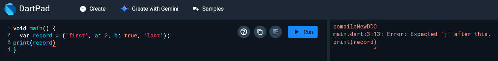

Error tersebut terjadi karena baris print(record) tidak diakhiri dengan tanda titik koma ( ; )

### Perbaikan

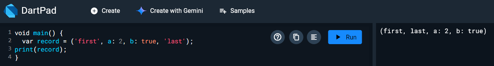

## Langkah 3

Tambahkan kode program berikut di luar scope void main(), lalu coba eksekusi (Run) kode Anda.

```dart
(int, int) tukar((int, int) record) {
  var (a, b) = record;
  return (b, a);
}
```

Apa yang terjadi ? Jika terjadi error, silakan perbaiki. Gunakan fungsi tukar() di dalam main() sehingga tampak jelas proses pertukaran value field di dalam Records.

Jawab : 

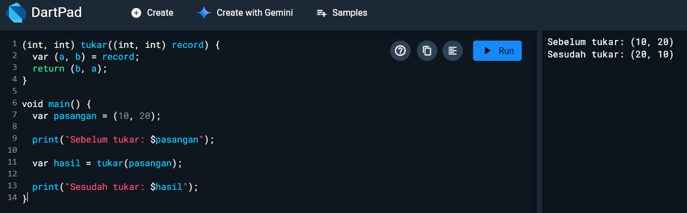

Jika kode fungsi tukar() ditempatkan di luar main(), lalu dijalankan, tidak ada error karena penulisan fungsi Record sudah benar. Fungsi ini menerima record (int, int) lalu menukar isinya menggunakan pattern matching.

## Langkah 4

Tambahkan kode program berikut di dalam scope void main(), lalu coba eksekusi (Run) kode Anda.

```dart
// Record type annotation in a variable declaration:
(String, int) mahasiswa;
print(mahasiswa);
```

Apa yang terjadi ? Jika terjadi error, silakan perbaiki. Inisialisasi field nama dan NIM Anda pada variabel record mahasiswa di atas. Dokumentasikan hasilnya dan buat laporannya!

Jawab : 

Terjadi error karena variabel record mahasiswa sudah dideklarasikan tetapi belum diberikan nilai (belum diinisialisasi). Perbaikannya dengan memberikan variabel record nilai awal 

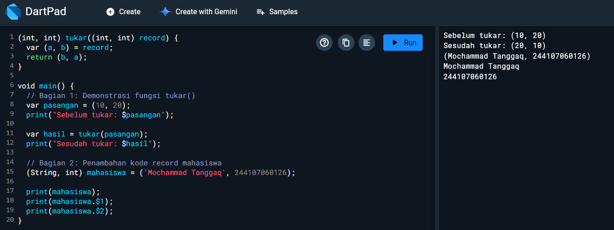

## Langkah 5

Tambahkan kode program berikut di dalam scope void main(), lalu coba eksekusi (Run) kode Anda.

```dart
var mahasiswa2 = ('first', a: 2, b: true, 'last');
print(mahasiswa2.$1); // Prints 'first'
print(mahasiswa2.a); // Prints 2
print(mahasiswa2.b); // Prints true
print(mahasiswa2.$2); // Prints 'last'
```

Apa yang terjadi ? Jika terjadi error, silakan perbaiki. Gantilah salah satu isi record dengan nama dan NIM Anda, lalu dokumentasikan hasilnya dan buat laporannya!

Jawab : 

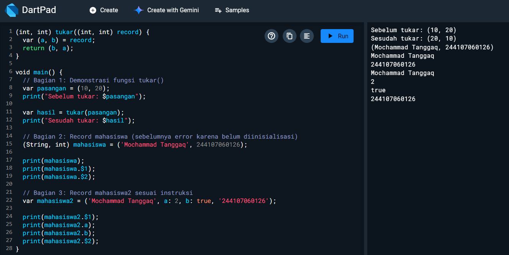

Program membuat sebuah record yang memiliki dua positional fields dan dua named fields. Record dapat diakses menggunakan indeks seperti $1 dan $2 untuk field positional, serta .a dan .b untuk field bernama. Setelah salah satu field record diganti dengan nama dan NIM, program berjalan normal dan mencetak nilai‐nilai record sesuai urutan aksesnya.

## TUGAS 

### 1. Silakan selesaikan Praktikum 1 sampai 5, lalu dokumentasikan berupa screenshot hasil pekerjaan Anda beserta penjelasannya!

### 2. Jelaskan yang dimaksud Functions dalam bahasa Dart!

Jawab : 

Function dalam Dart adalah sekumpulan perintah (statements) yang dikelompokkan menjadi satu blok kode untuk menjalankan tugas tertentu. Function dapat memiliki parameter, mengembalikan nilai (return value), dan dapat dipanggil berkali-kali.

### 3. Jelaskan jenis-jenis parameter di Functions beserta contoh sintaksnya!

Jawab :

#### a. Positional Parameters

Parameter yang harus diberikan sesuai urutan.

#### b. Optional Positional Parameters

Diberi tanda [ ] dan nilainya opsional.

#### c. Named Parameters

Diberi tanda { }, bisa diberi required atau default value.

### 4. Jelaskan maksud Functions sebagai first-class objects beserta contoh sintaknya!

Jawab : 

Di Dart, function adalah first-class objects, artinya:

dapat disimpan ke variabel

dapat dikirim sebagai parameter

dapat dikembalikan sebagai nilai (return function)

### 5. Apa itu Anonymous Functions? Jelaskan dan berikan contohnya!

Jawab : 

Anonymous Function adalah function tanpa nama. Cocok digunakan untuk callback atau fungsi pendek.

### 6. Jelaskan perbedaan Lexical scope dan Lexical closures! Berikan contohnya!

Jawab : 

#### 1. Lexical Scope

Variabel dapat diakses berdasarkan lokasi penulisan kode (struktur blok).

#### 2. Lexical Closure

Function “mengikat (capture)” variabel di luar scope-nya, sehingga tetap bisa digunakan walaupun scope awalnya sudah selesai dieksekusi.

### 7. Jelaskan dengan contoh cara membuat return multiple value di Functions!

Jawab : 

Dart menggunakan Record untuk mengembalikan lebih dari satu nilai.

Contoh:

```dart
(String, int) getData() {
  return ('Mochammad Tanggaq', 244107060126);
}

void main() {
  var (nama, nim) = getData();
  print(nama);
  print(nim);
}
```

Kumpulkan berupa link commit repo GitHub kepada dosen pengampu sesuai kesepakatan di kelas!