# Laporan Praktikum #05 | Aplikasi Pertama dan Widget Dasar Flutter

## Identitas Mahasiswa

| Atribut | Nilai                           |
| ------- | -----                           |
| Nama    | Mochammad Tanggaq Dirat Saputra |
| NIM     | 244107060126                    |
| Kelas   | SIB-2D                          |
---------------------------------------------

# Tugas Praktikum 5

# Percobaan 1 : Membuat Project Flutter Baru

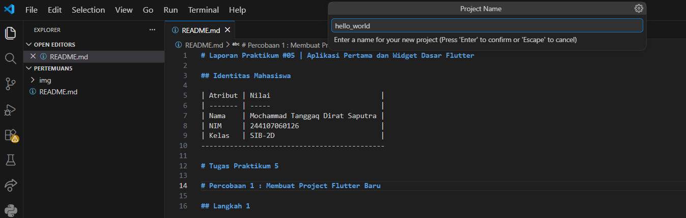


# Percobaan 2 : Menghubungkan Perangkat Android atau Emulator
## Langkah 1
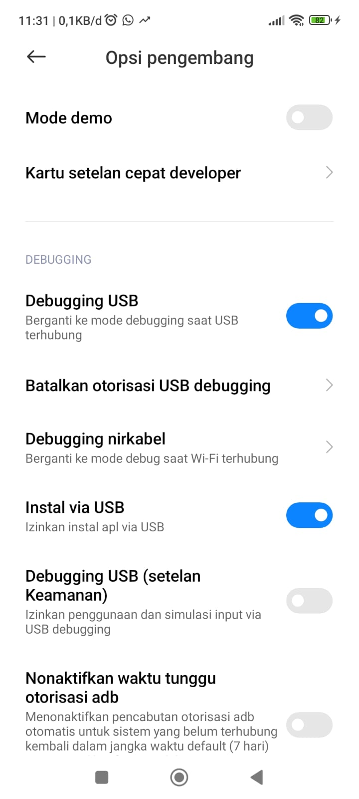

## Langkah 2
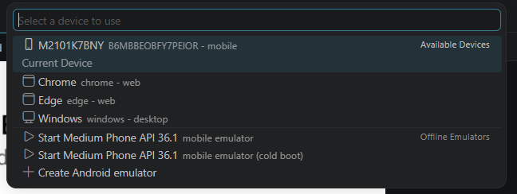

# Percobaan 3 : Membuat Repository GitHub dan Laporan Praktikum
## Langkah 11 
ubah platform di pojok kanan bawah ke emulator atau device atau bisa juga menggunakan browser Chrome. Lalu coba running project hello_world dengan tekan F5 atau Run > Start Debugging. Tunggu proses kompilasi hingga selesai, maka aplikasi flutter pertama Anda akan tampil seperti berikut.
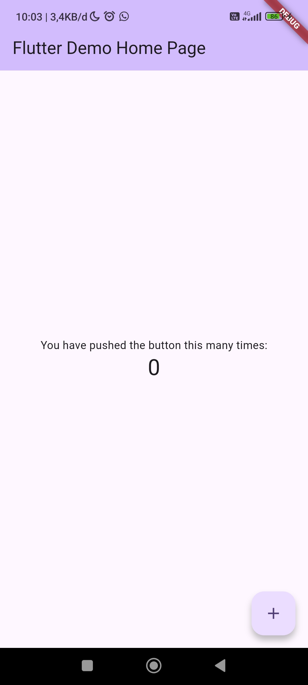

# Percobaan 4 : Menerapkan Widget Dasar
## Langkah 12
Silakan screenshot seperti pada Langkah 11, namun teks yang ditampilkan dalam aplikasi berupa nama lengkap Anda. Simpan file screenshot dengan nama 01.png pada folder images (buat folder baru jika belum ada) di project hello_world Anda. Lalu ubah isi README.md seperti berikut, sehingga tampil hasil screenshot pada file README.md. Kemudian push ke repository Anda.
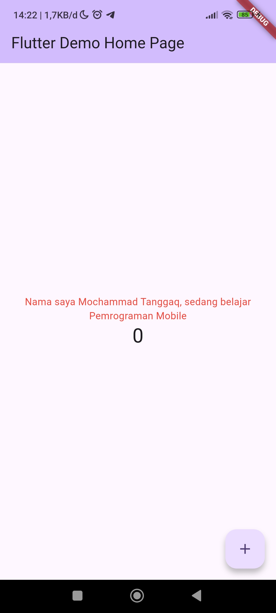

## Langkah 13
```dart
import 'package:flutter/material.dart';
import 'basic_widgets/text_widget.dart';  
import 'basic_widgets/image_widget.dart';
import 'basic_widgets/loading_cupertino.dart';
import 'basic_widgets/fab_widget.dart';

void main() {
  runApp(const MyApp());
}

class MyApp extends StatelessWidget {
  const MyApp({super.key});

  @override
  Widget build(BuildContext context) {
    return MaterialApp(
      title: 'Flutter Demo',
      theme: ThemeData(
        colorScheme: .fromSeed(seedColor: Colors.deepPurple),
      ),
      home: const MyHomePage(title: 'Flutter Demo Home Page'),
    );
  }
}

class MyHomePage extends StatefulWidget {
  const MyHomePage({super.key, required this.title});
  final String title;

  @override
  State<MyHomePage> createState() => _MyHomePageState();
}

class _MyHomePageState extends State<MyHomePage> {
  int _counter = 0;

  void _incrementCounter() {
    setState(() {
      _counter++;
    });
  }

  @override
  Widget build(BuildContext context) {
    return Scaffold(
      appBar: AppBar(
        backgroundColor: Theme.of(context).colorScheme.inversePrimary,
      ),
      body: Center(
        child: Column(
          mainAxisAlignment: MainAxisAlignment.center,
          children: <Widget>[
            const LoadingCupertino(),
            Text(
              '$_counter',
              style: Theme.of(context).textTheme.headlineMedium,
            ),
          ],
        ),
      ),
      floatingActionButton: FloatingActionButton(
        onPressed: _incrementCounter,
        tooltip: 'Increment',
        child: const Icon(Icons.add),
      ),
    );
  }
}
```
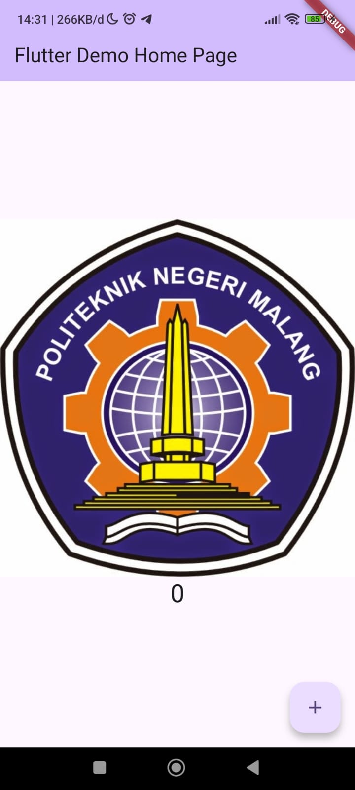

## Langkah 14 
``` dart
import 'package:flutter/material.dart';
import 'basic_widgets/text_widget.dart';  
import 'basic_widgets/image_widget.dart';
import 'basic_widgets/loading_cupertino.dart';
import 'basic_widgets/fab_widget.dart';

void main() {
  runApp(const MyApp());
}

class MyApp extends StatelessWidget {
  const MyApp({super.key});

  @override
  Widget build(BuildContext context) {
    return MaterialApp(
      title: 'Flutter Demo',
      theme: ThemeData(
        colorScheme: .fromSeed(seedColor: Colors.deepPurple),
      ),
      home: const MyHomePage(title: 'Flutter Demo Home Page'),
    );
  }
}

class MyHomePage extends StatefulWidget {
  const MyHomePage({super.key, required this.title});

  final String title;

  @override
  State<MyHomePage> createState() => _MyHomePageState();
}

class _MyHomePageState extends State<MyHomePage> {
  int _counter = 0;

  void _incrementCounter() {
    setState(() {
      _counter++;
    });
  }

  @override
  Widget build(BuildContext context) {
    return Scaffold(
      appBar: AppBar(
        backgroundColor: Theme.of(context).colorScheme.inversePrimary,
        title: Text(widget.title),
      ),
      body: Center(
        child: Column(
          mainAxisAlignment: MainAxisAlignment.center,
          children: <Widget>[
            const FabWidget(),
            Text(
              '$_counter',
              style: Theme.of(context).textTheme.headlineMedium,
            ),
          ],
        ),
      ),
      floatingActionButton: FloatingActionButton(
        onPressed: _incrementCounter,
        tooltip: 'Increment',
        child: const Icon(Icons.add),
      ),
    );
  }
}
```
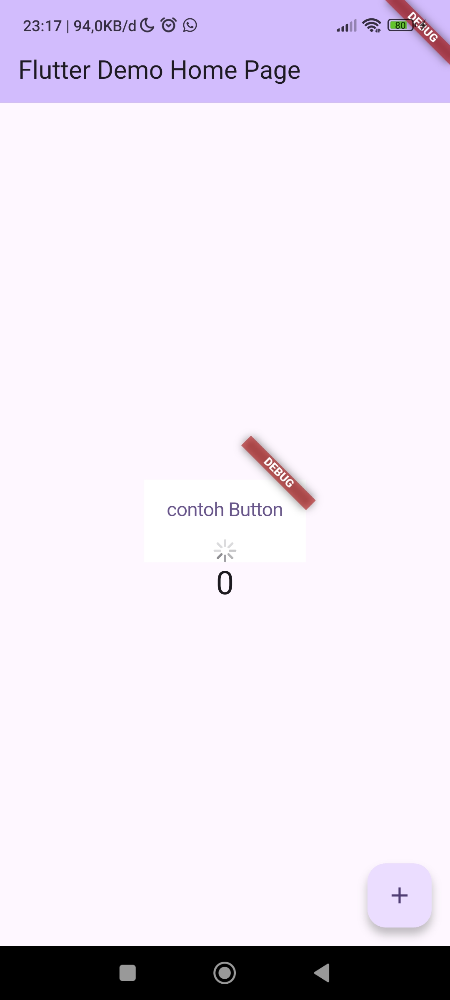

## Langkah 15 
```dart
return MaterialApp(
      home: Scaffold(
        floatingActionButton: FloatingActionButton(
          onPressed: () {
            // Add your onPressed code here!
          },
          child: const Icon(Icons.thumb_up),
          backgroundColor: Colors.pink,
        ),
      ),
    );
```
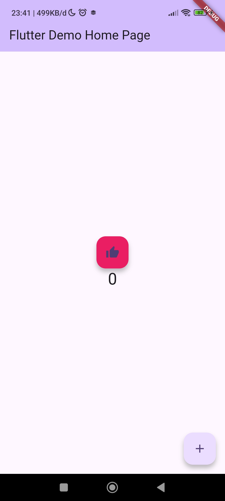


## Langkah 3 : SCAFFOLD WIDGET
```dart
import 'package:flutter/material.dart';

void main() {
  runApp(const MyApp());
}

class MyApp extends StatelessWidget {
  const MyApp({Key? key}) : super(key: key);

  // This widget is the root of your application.
  @override
  Widget build(BuildContext context) {
    return MaterialApp(
      title: 'Flutter Demo',
      theme: ThemeData(
        primarySwatch: Colors.red,
      ),
      home: const MyHomePage(title: 'My Increment App'),
    );
  }
}

class MyHomePage extends StatefulWidget {
  const MyHomePage({Key? key, required this.title}) : super(key: key);

  final String title;

  @override
  State<MyHomePage> createState() => _MyHomePageState();
}

class _MyHomePageState extends State<MyHomePage> {
  int _counter = 0;

  void _incrementCounter() {
    setState(() {
      _counter++;
    });
  }

  @override
  Widget build(BuildContext context) {
    return Scaffold(
      appBar: AppBar(
        title: Text(widget.title),
      ),
      body: Center(
        child: Column(
          mainAxisAlignment: MainAxisAlignment.center,
          children: <Widget>[
            const Text(
              'You have pushed the button this many times:',
            ),

          ],
        ),
      ),
      bottomNavigationBar: BottomAppBar(
        child: Container(
          height: 50.0,
        ),
      ),
      floatingActionButton: FloatingActionButton(
        onPressed: _incrementCounter,
        tooltip: 'Increment Counter',
        child: const Icon(Icons.add),
      ), 
      floatingActionButtonLocation: FloatingActionButtonLocation.centerDocked,
    );
  }
}
```
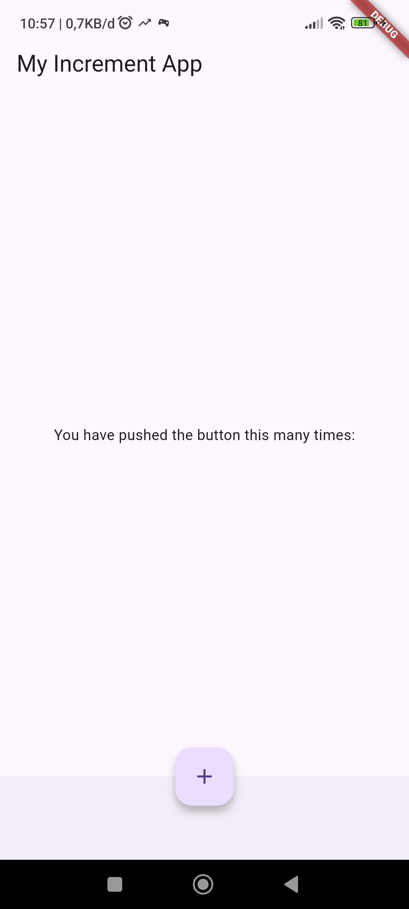

## LANGKAH 4 : DIALOG WIDGET
```dart
import 'package:flutter/material.dart';

void main() {
  runApp(const MyApp());
}

class MyApp extends StatelessWidget {
  const MyApp({Key? key}) : super(key: key);

  @override
  Widget build(BuildContext context) {
    return const MaterialApp(
      debugShowCheckedModeBanner: false,
      home: Scaffold(
        body: MyLayout(),
      ),
    );
  }
}

class MyLayout extends StatelessWidget {
  const MyLayout({Key? key}) : super(key: key);

  @override
  Widget build(BuildContext context) {
    return Center( // 🔥 ini yang bikin tombol di tengah
      child: ElevatedButton(
        child: const Text('Show Alert'),
        onPressed: () {
          showAlertDialog(context);
        },
      ),
    );
  }
}

void showAlertDialog(BuildContext context) {
  Widget okButton = TextButton(
    child: const Text("OK"),
    onPressed: () {
      Navigator.pop(context);
    },
  );

  AlertDialog alert = const AlertDialog(
    title: Text("My Title"),
    content: Text("This is my message."),
  );

  showDialog(
    context: context,
    builder: (BuildContext context) {
      return AlertDialog(
        title: const Text("My Title"),
        content: const Text("This is my message."),
        actions: [okButton],
      );
    },
  );
}
```
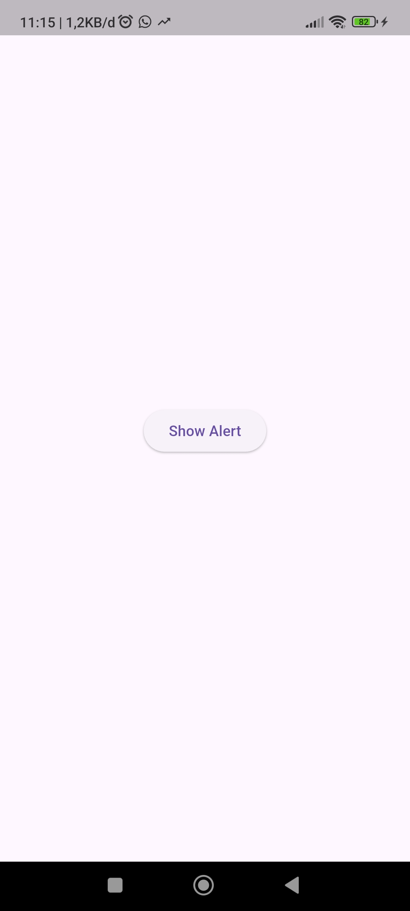
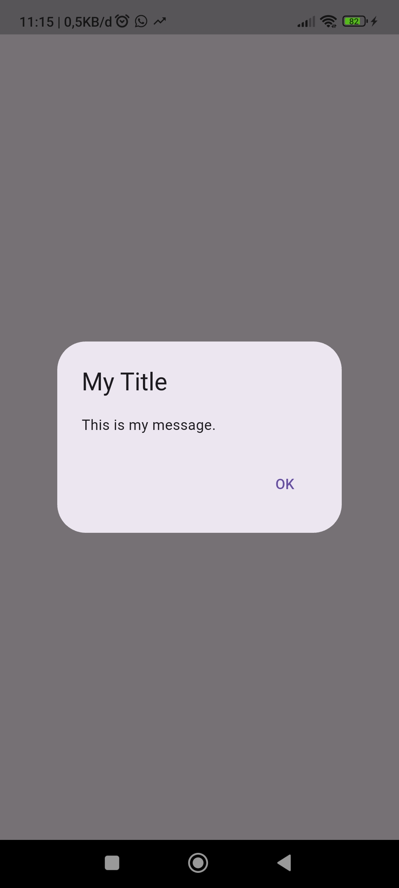

## LANGKAH 5 : Input dan Selection Widget
import 'package:flutter/material.dart';

void main() {
  runApp(const MyApp());
}

class MyApp extends StatelessWidget {
  const MyApp({Key? key}) : super(key: key);

  @override
  Widget build(BuildContext context) {
    return MaterialApp(
      debugShowCheckedModeBanner: false,
      home: const InputSelectionPage(),
    );
  }
}

class InputSelectionPage extends StatefulWidget {
  const InputSelectionPage({Key? key}) : super(key: key);

  @override
  State<InputSelectionPage> createState() => _InputSelectionPageState();
}

class _InputSelectionPageState extends State<InputSelectionPage> {
  final TextEditingController nameController = TextEditingController();

  String? selectedGender; // dropdown value

  @override
  Widget build(BuildContext context) {
    return Scaffold(
      appBar: AppBar(
        title: const Text("Input & Selection Widgets"),
      ),
      body: Padding(
        padding: const EdgeInsets.all(16.0),
        child: Column(
          crossAxisAlignment: CrossAxisAlignment.start,
          children: [

            // 🔹 Input TextField
            const Text(
              "Masukkan Nama:",
              style: TextStyle(fontSize: 16, fontWeight: FontWeight.bold),
            ),
            const SizedBox(height: 6),
            TextField(
              controller: nameController,
              decoration: const InputDecoration(
                border: OutlineInputBorder(),
                labelText: 'Nama',
              ),
            ),

            const SizedBox(height: 20),

            // 🔹 Dropdown Selection Widget
            const Text(
              "Pilih Jenis Kelamin:",
              style: TextStyle(fontSize: 16, fontWeight: FontWeight.bold),
            ),
            const SizedBox(height: 6),
            DropdownButtonFormField<String>(
              decoration: const InputDecoration(
                border: OutlineInputBorder(),
              ),
              value: selectedGender,
              items: const [
                DropdownMenuItem(value: "Laki-laki", child: Text("Laki-laki")),
                DropdownMenuItem(value: "Perempuan", child: Text("Perempuan")),
              ],
              onChanged: (value) {
                setState(() {
                  selectedGender = value;
                });
              },
            ),

            const SizedBox(height: 30),

            // 🔹 Button Submit
            Center(
              child: ElevatedButton(
                onPressed: () {
                  String name = nameController.text;
                  String gender = selectedGender ?? "Belum dipilih";

                  showDialog(
                    context: context,
                    builder: (context) {
                      return AlertDialog(
                        title: const Text("Hasil Input"),
                        content: Text("Nama: $name\nJenis Kelamin: $gender"),
                        actions: [
                          TextButton(
                            onPressed: () => Navigator.pop(context),
                            child: const Text("OK"),
                          )
                        ],
                      );
                    },
                  );
                },
                child: const Text("Kirim"),
              ),
            ),
          ],
        ),
      ),
    );
  }
}
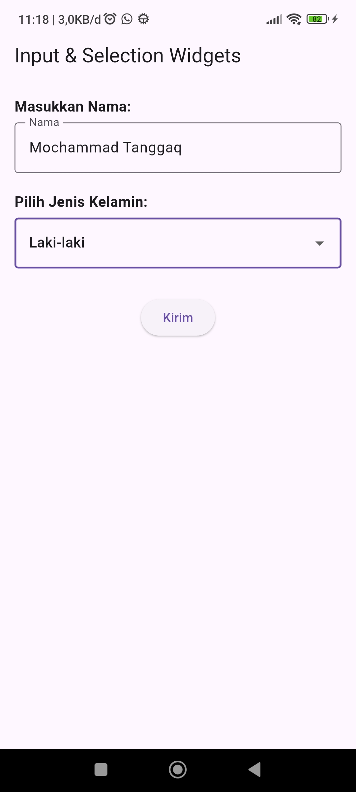
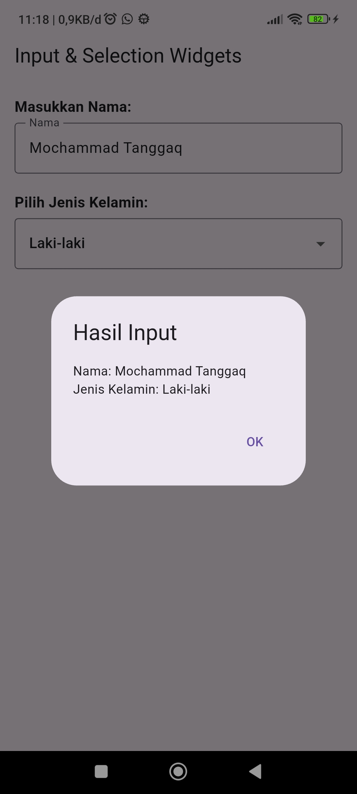

## Langkah 6 : DATE 
```dart
import 'dart:async';
import 'package:flutter/material.dart';

void main() => runApp(const MyApp());

class MyApp extends StatelessWidget {
  const MyApp({Key? key}) : super(key: key);

  @override
  Widget build(BuildContext context) {
    return const MaterialApp(
      title: 'Contoh Date Picker',
      home: MyHomePage(title: 'Contoh Date Picker'),
    );
  }
}

class MyHomePage extends StatefulWidget {
  const MyHomePage({Key? key, required this.title}) : super(key: key);

  final String title;

  @override
  State<MyHomePage> createState() => _MyHomePageState();
}

class _MyHomePageState extends State<MyHomePage> {
  DateTime selectedDate = DateTime.now();

  Future<void> _selectDate(BuildContext context) async {
    final DateTime? picked = await showDatePicker(
      context: context,
      initialDate: selectedDate,
      firstDate: DateTime(2015),
      lastDate: DateTime(2101),
    );

    if (picked != null && picked != selectedDate) {
      setState(() {
        selectedDate = picked;
      });
    }
  }

  @override
  Widget build(BuildContext context) {
    return Scaffold(
      appBar: AppBar(
        title: Text(widget.title),
      ),
      body: Center(
        child: Column(
          mainAxisSize: MainAxisSize.min,
          children: <Widget>[
            Text(
              "${selectedDate.toLocal()}".split(' ')[0],
              style: const TextStyle(fontSize: 20),
            ),
            const SizedBox(height: 20),
            ElevatedButton(
              onPressed: () => _selectDate(context),
              child: const Text('Pilih Tanggal'),
            ),
          ],
        ),
      ),
    );
  }
}
```
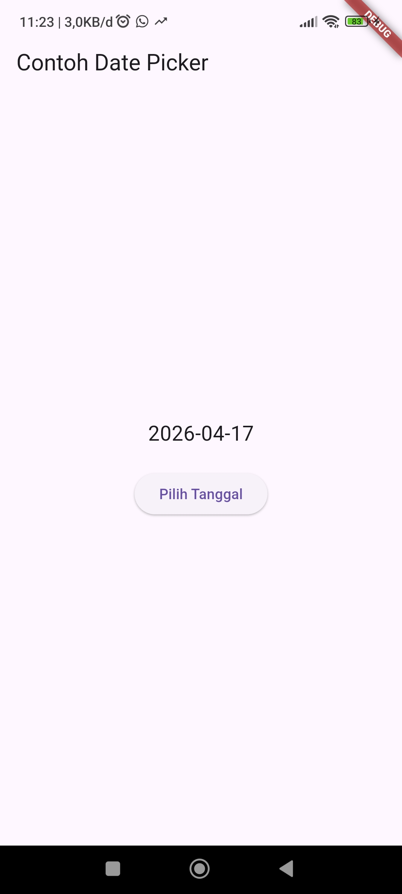
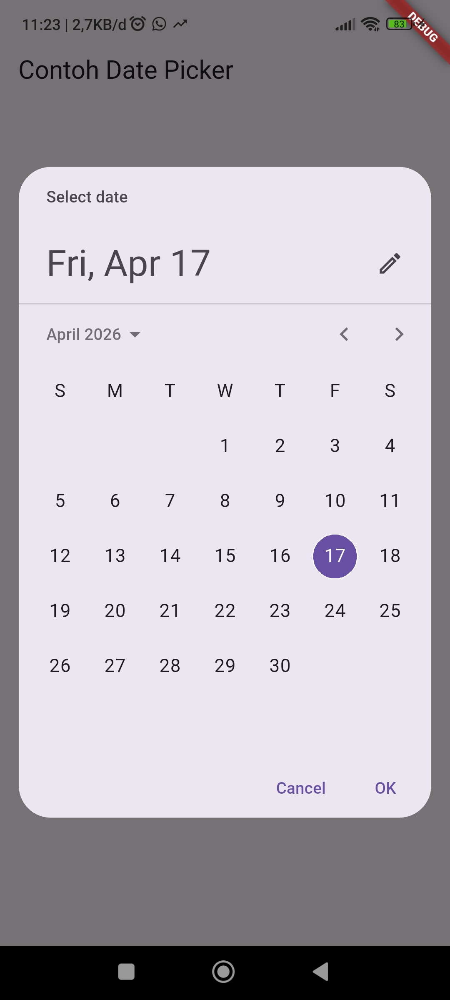
