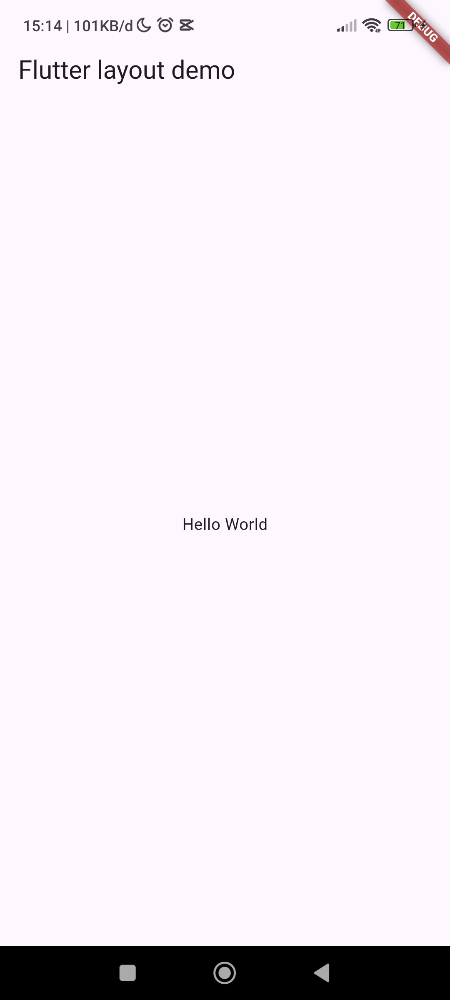
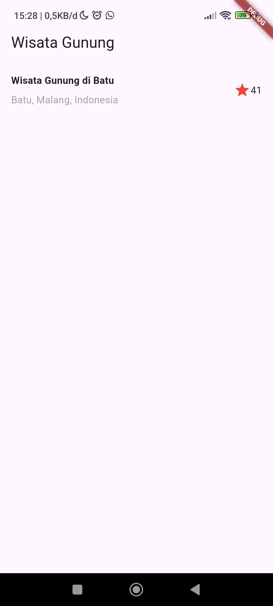
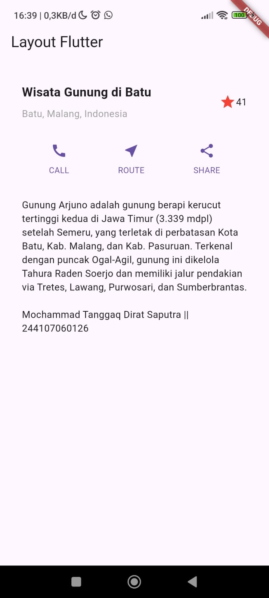
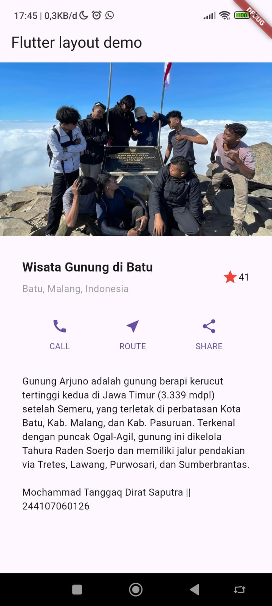
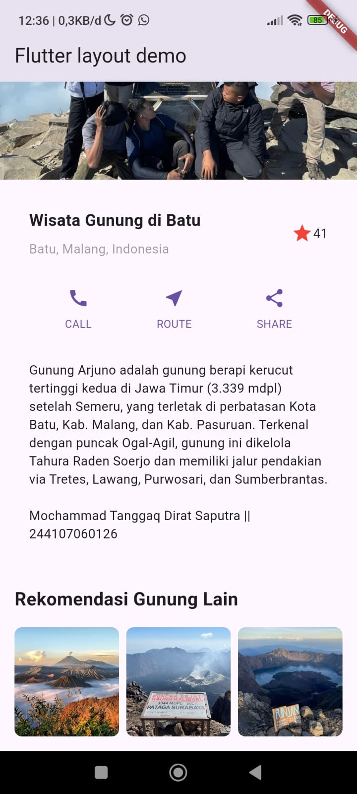

# Laporan Praktikum #06 | Layout dan Navigasi

## Identitas Mahasiswa

| Atribut | Nilai                           |
| ------- | -----                           |
| Nama    | Mochammad Tanggaq Dirat Saputra |
| NIM     | 244107060126                    |
| Kelas   | SIB-2D                          |
---------------------------------------------

# Tugas Praktikum 1

## Soal 1

Selesaikan Praktikum 1 sampai 4, lalu dokumentasikan dan push ke repository Anda berupa screenshot setiap hasil pekerjaan beserta penjelasannya di file README.md!



### PRAKTIKUM 1: Membangun Layout di Flutter

**Langkah 2**

``` dart
import 'package:flutter/material.dart';

void main() => runApp(const MyApp());

class MyApp extends StatelessWidget {
  const MyApp({super.key});

  @override
  Widget build(BuildContext context) {
    return MaterialApp(
      title: 'Flutter layout: Nama dan NIM Anda',
      home: Scaffold(
        appBar: AppBar(
          title: const Text('Flutter layout demo'),
        ),
        body: const Center(
          child: Text('Hello World'),
        ),
      ),
    );
  }
}
```

**Langkah 4**

Pertama, Anda akan membuat kolom bagian kiri pada judul. Tambahkan kode berikut di bagian atas metode build() di dalam kelas MyApp:

``` dart
Widget titleSection = Container(
  padding: const EdgeInsets.all(...),
  child: Row(
    children: [
      Expanded(
        /* soal 1*/
        child: Column(
          crossAxisAlignment: ...,
          children: [
            /* soal 2*/
            Container(
              padding: const EdgeInsets.only(bottom: ...),
              child: const Text(
                'Wisata Gunung di Batu',
                style: TextStyle(
                  fontWeight: FontWeight.bold,
                ),
              ),
            ),
            Text(
              'Batu, Malang, Indonesia',
              style: TextStyle(...),
            ),
          ],
        ),
      ),
      /* soal 3*/
      Icon(
       ...,
        color: ...,
      ),
      const Text(...),
    ],
  ),
);
```
- OUTPUT



### Praktikum 2: Implementasi button row

**Langkah 1**

Bagian tombol berisi 3 kolom yang menggunakan tata letak yang sama—sebuah ikon di atas baris teks. Kolom pada baris ini diberi jarak yang sama, dan teks serta ikon diberi warna primer. Karena kode untuk membangun setiap kolom hampir sama, buatlah metode pembantu pribadi bernama buildButtonColumn(), yang mempunyai parameter warna, Icon dan Text, sehingga dapat mengembalikan kolom dengan widgetnya sesuai dengan warna tertentu.

``` dart
class MyApp extends StatelessWidget {
  const MyApp({super.key});

  @override
  Widget build(BuildContext context) {
    // ···
  }

  Column _buildButtonColumn(Color color, IconData icon, String label) {
    return Column(
      mainAxisSize: MainAxisSize.min,
      mainAxisAlignment: MainAxisAlignment.center,
      children: [
        Icon(icon, color: color),
        Container(
          margin: const EdgeInsets.only(top: 8),
          child: Text(
            label,
            style: TextStyle(
              fontSize: 12,
              fontWeight: FontWeight.w400,
              color: color,
            ),
          ),
        ),
      ],
    );
  }
}
```

**Langkah 2**

``` dart
Color color = Theme.of(context).primaryColor;

Widget buttonSection = Row(
  mainAxisAlignment: MainAxisAlignment.spaceEvenly,
  children: [
    _buildButtonColumn(color, Icons.call, 'CALL'),
    _buildButtonColumn(color, Icons.near_me, 'ROUTE'),
    _buildButtonColumn(color, Icons.share, 'SHARE'),
  ],
);
```
**Langkah 3 : Tambah Button Section ke Body**

- OUTPUT


### Praktikum 3: Implementasi text section

- OUTPUT



### Praktikum 4: Implementasi image section

- OUTPUT



## Soal 2
Silakan implementasikan di project baru "basic_layout_flutter" dengan mengakses sumber ini: https://docs.flutter.dev/codelabs/layout-basics 

### Menambahkan rekomendasi section
``` dart
static Widget _buildRecommendationSection() {
    return Container(
      padding: const EdgeInsets.all(16),
      child: Column(
        crossAxisAlignment: CrossAxisAlignment.start,
        children: [
          const Text(
            'Rekomendasi Gunung Lain',
            style: TextStyle(fontSize: 20, fontWeight: FontWeight.bold),
          ),
          const SizedBox(height: 16),

          Row(
            crossAxisAlignment: CrossAxisAlignment.center,
            children: [
              _buildRecommendationImage('images/gunung_bromo.jpeg'),
              const SizedBox(width: 8),
              _buildRecommendationImage('images/gunung_raung.jpeg'),
              const SizedBox(width: 8),
              _buildRecommendationImage('images/gunung_rinjani.jpeg'),
            ],
          ),
        ],
      ),
    );
  }
```
### Tambahkan juga di body 
``` dart
        body: ListView(
          children: [
            _buildImageHeader(),
            _buildTitleSection(),
            _buildButtonSection(context),
            _buildTextSection(),
            _buildRecommendationSection(),
          ],
        ),
```

- OUTPUT

