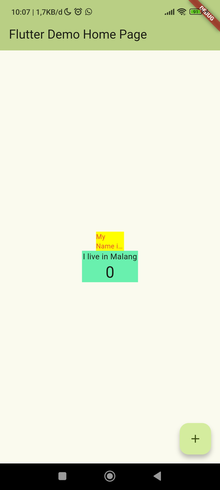

# Laporan Praktikum #07 | Manajemen Plugin

## Identitas Mahasiswa

| Atribut | Nilai                           |
| ------- | -----                           |
| Nama    | Mochammad Tanggaq Dirat Saputra |
| NIM     | 244107060126                    |
| Kelas   | SIB-2D                          |
---------------------------------------------

# Tugas Praktikum 7

## Soal 1
Selesaikan Praktikum tersebut, lalu dokumentasikan dan push ke repository Anda berupa screenshot hasil pekerjaan beserta penjelasannya di file README.md!

**red_text_widget.dart**
``` dart
import 'package:flutter/material.dart';
import 'package:auto_size_text/auto_size_text.dart';

class RedTextWidget extends StatelessWidget {
  final String text;

  const RedTextWidget({Key? key, required this.text}) : super(key: key);
  
  @override
  Widget build(BuildContext context) {
    return AutoSizeText(
      text,
      style: const TextStyle(color: Colors.red, fontSize: 14),
      maxLines: 2,
      overflow: TextOverflow.ellipsis,
    );
  }
}
```
**main.dart**
``` dart
import 'package:flutter/material.dart';
import 'package:flutter_plugin_pubdev/red_text_widget.dart';

void main() {
  runApp(const MyApp());
}

class MyApp extends StatelessWidget {
  const MyApp({super.key});

  @override
  Widget build(BuildContext context) {
    return MaterialApp(
      title: 'Flutter Demo',
      theme: ThemeData(
        colorScheme: .fromSeed(seedColor: Colors.deepPurple),
      ),
      home: const MyHomePage(title: 'Flutter Demo Home Page'),
    );
  }
}

class MyHomePage extends StatefulWidget {
  const MyHomePage({super.key, required this.title});

  final String title;

  @override
  State<MyHomePage> createState() => _MyHomePageState();
}

class _MyHomePageState extends State<MyHomePage> {
  int _counter = 0;

  void _incrementCounter() {
    setState(() {
      _counter++;
    });
  }

  @override
  Widget build(BuildContext context) {
    return Scaffold(
      appBar: AppBar(
        backgroundColor: Theme.of(context).colorScheme.inversePrimary,
        title: Text(widget.title),
      ),
      body: Center(
        child: Column(
          mainAxisAlignment: MainAxisAlignment.center,
          children: <Widget>[
            Container(
              color: Colors.yellowAccent,
              width: 50,
              child: const RedTextWidget(
                text: 'My Name is Mochammad Tanggaq',
              ),
            ),

            Container(
              color: Colors.greenAccent,
              width: 100,
              child: const Text(
                'I live in Malang'
              ),
            )
          ],
        ),
      ),
      floatingActionButton: FloatingActionButton(
        onPressed: _incrementCounter,
        tooltip: 'Increment',
        child: const Icon(Icons.add),
      ),
    );
  }
}
```

**Output**


## Soal 2
Jelaskan maksud dari langkah 2 pada praktikum tersebut!
``` dart
flutter pub add auto_size_text
```
Command flutter di atas digunakan untuk menginstalasi atau menambahkan package auto_size_text ke dalam aplikasi Flutter, sehingga nantinya package ini dapat digunakan untuk menampilkan teks yang ukuran font-nya bisa menyesuaikan secara otomatis.

## Soal 3
Jelaskan maksud dari langkah 5 pada praktikum tersebut!
``` dart
final String text;

const RedTextWidget({Key? key, required this.text}) : super(key: key);
```
Kode diatas digunakan untuk mendefinisikan widget bernama RedTextWidget yang memiliki satu variabel text bertipe String yang nilainya tidak bisa diubah setelah dibuat (final), konstruktornya mengharuskan pengguna menyediakan nilai text saat membuat widget ini, sedangkan key bersifat opsional dan diteruskan ke class induknya.

## Soal 4
Pada langkah 6 terdapat dua widget yang ditambahkan, jelaskan fungsi dan perbedaannya!
``` dart
Container(
   color: Colors.yellowAccent,
   width: 50,
   child: const RedTextWidget(
             text: 'You have pushed the button this many times:',
          ),
),
Container(
    color: Colors.greenAccent,
    width: 100,
    child: const Text(
           'You have pushed the button this many times:',
          ),
),
```
Pada Container pertama memiliki backgroud kuning dengan lebar 50px dan menampilkan text berwarna merah karena menggunakan RedTextWidget sebagai childnya. RedTextWidget ini dilengkapi fitur auto-resize dari plugin AutoSizeText, sehingga teks otomatis menyesuaikan ukurannya agar muat dalam ruang yang ada, maksimal 2 baris dan akan terpotong dengan tanda "..." jika terlalu panjang

Sedangkan pada Container kedua memiliki background hijau dengan lebar 100px dan menampilkan teks menggunakan widget Text biasa tanpa fitur auto-resize dan warna teks default(hitam)

Perbedaan 2 Container tersebut adalah Container pertama memakai custom widget dengan fitur auto-resize, sedangkan Container kedua pakai widget bawaan yang tidak memiliki fitur auto-resize.

## Soal 5
Jelaskan maksud dari tiap parameter yang ada di dalam plugin auto_size_text berdasarkan tautan pada dokumentasi ini!

Berikut penjelasan parameter utama pada plugin AutoSizeText:

- **text:** Isi teks yang akan ditampilkan dengan ukuran huruf yang dapat menyesuaikan secara otomatis.
- **style:** Menentukan tampilan teks, seperti warna, ukuran font awal, ketebalan, dan jenis huruf.
- **maxLines:** Membatasi jumlah baris maksimal yang boleh digunakan untuk menampilkan teks. Jika melebihi batas, bagian sisa akan dipangkas.
- **minFontSize:** Ukuran font terkecil yang boleh dipakai ketika AutoSizeText mengecilkan teks agar muat.
- **maxFontSize:** Ukuran font terbesar yang boleh dipakai.
- **stepGranularity:** Mengatur “langkah” perubahan ukuran font saat menyesuaikan. Nilai kecil membuat penyesuaian lebih halus.
- **presetFontSizes:** Daftar ukuran font yang bisa dicoba oleh AutoSizeText untuk menemukan ukuran yang paling pas.
- **group:** Menghubungkan beberapa AutoSizeText agar mereka menggunakan ukuran font yang sama. Cocok untuk membuat layout konsisten.
- **textAlign:** Mengatur perataan teks (left, right, center, justify).
- **textDirection:** Menentukan arah tulisan, misalnya LTR (kiri ke kanan) atau RTL (kanan ke kiri).
- **overflow:** Mengatur bagaimana teks yang kelebihan ditampilkan—misalnya dipotong atau diberi elipsis (...).
- **softWrap:** Menentukan apakah teks boleh berpindah ke baris berikutnya secara otomatis.

## Soal 6
Kumpulkan laporan praktikum Anda berupa link repository GitHub kepada dosen!